# Critical points and approximation {#critical-points}

## Learning objectives {-}

* Define critical points
* Calculate critical points via analytical methods
* Demonstrate optimization using maximum likelihood estimation
* Identify need for approximation methods for calculating critical points
* Explain and demonstrate root finding procedures using Newton-Raphson hill climber
* Demonstrate comptuational optimization using gradient descent

## Supplemental readings {-}

* Chapters 8, 9.1-.2, 10, @pemberton2015
* [OpenStax Calculus: Volume 1, ch 4](https://openstax.org/details/books/calculus-volume-1)

## Intuition

Recall [Rolle's Theorem](sequences-derivatives.html#relative-maxima-minima-and-derivatives):

::: {.theorem echo=TRUE name="Rolle's theorem"}
Suppose $f:[a, b] \rightarrow \Re$.  Suppose $f$ has a relative maxima or minima on $(a,b)$ and call that $c \in (a, b)$.  Then $f'(c) = 0$.
:::

Intuition:

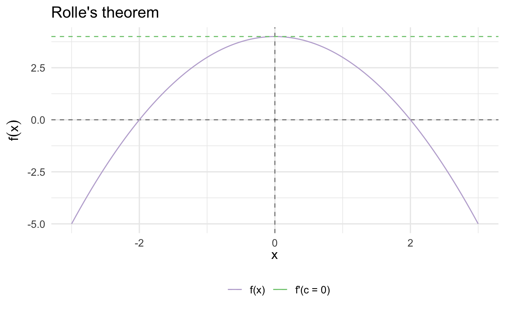

Rolle's theorem guarantee's that, at some point, $f^{'}(x) = 0$. Think about the intuition given this theorem. What happens as we approach from the left? What happens as we approach from the right?

## Higher order derivatives

The first derivative is applying the definition of derivatives on the function, and it can be expressed as

$$f'(x),  ~~ y',  ~~ \frac{d}{dx}f(x), ~~ \frac{dy}{dx}$$

We can keep applying the differentiation process to functions that are themselves derivatives.  The derivative of $f'(x)$ with respect to $x$, would then be $$f''(x)=\lim\limits_{h\to 0}\frac{f'(x+h)-f'(x)}{h}$$ and we can therefore call it the __Second derivative:__ 

$$f''(x), ~~ y'', ~~ \frac{d^2}{dx^2}f(x), ~~ \frac{d^2y}{dx^2}$$

Similarly, the derivative of $f''(x)$ would be called the third derivative and is denoted $f'''(x)$. And by extension, the __nth derivative__  is expressed as  $\frac{d^n}{dx^n}f(x)$, $\frac{d^ny}{dx^n}$.

$$
\begin{aligned}
f(x) &=x^3\\
f^{\prime}(x) &=3x^2\\
f^{\prime\prime}(x) &=6x \\
f^{\prime\prime\prime}(x) &=6\\
f^{\prime\prime\prime\prime}(x) &=0\\
\end{aligned}
$$

Earlier, we said that [if a function is differentiable at a given point, then it must be continuous](sequences-derivatives.html#continuity-and-derivatives). Further, if $f'(x)$ is itself continuous, then $f(x)$ is called **continuously differentiable**. All of this matters because many of our findings about optimization rely on differentiation, and so we want our function to be differentiable in as many layers.  A function that is continuously differentiable infinitely is called **smooth**. Some examples include:

$$
\begin{aligned}
f(x) &= x^2 \\
f(x) &= e^x
\end{aligned}
$$

## Critical points

One important purpose of derivatives is to find **critical points** along a function. Critical points are points on the domain of a function where the function is either not differentiable or the derivative is equal to zero.

### Inflection point

For a given function $y = f(x)$, a point $(x^∗, y^∗)$ is called an **inflection point** if the second derivative immediately on one side of the point is signed oppositely to the second derivative immediately on the other side. Graphically, this occurs if the tangent line switches sides of the function at the inflection point.

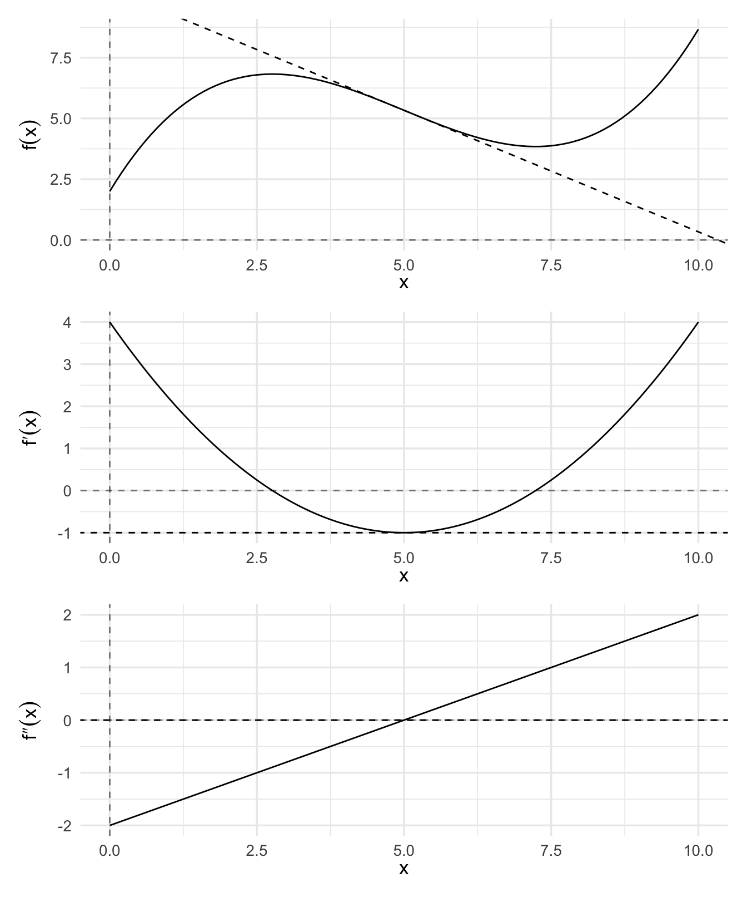

### Concavity

* **Concave up **(convex) - for a segment of a function, every possible **chord** (line segment connecting points along $f(x)$) is above the function
* **Concave down** (concave) - for a segment of a function, every possible chord is below the function

This can be verified both graphically and analytically using the second derivative. Where a function is twice differentiable and concave over some area, then the function is concave down where $f''(x) < 0$ and concave up where $f''(x) > 0$.

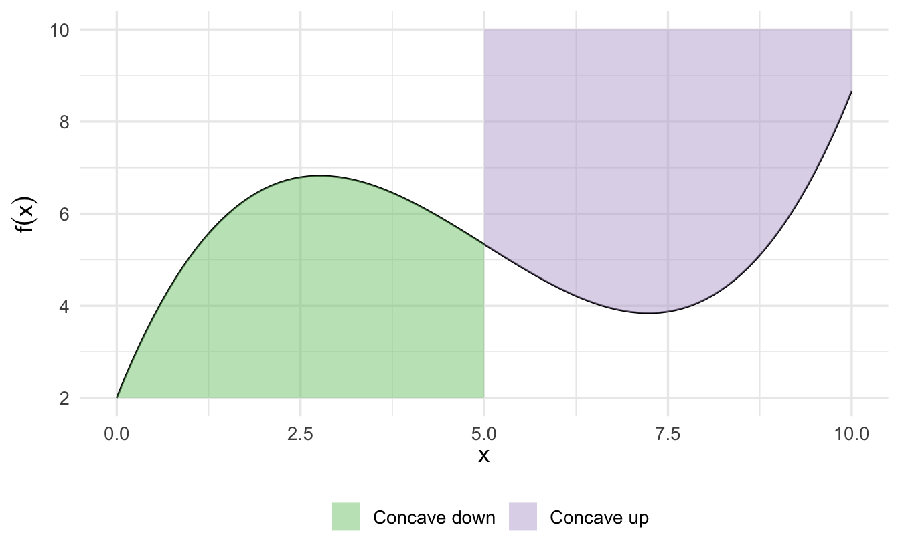

Some functions are **strictly concave up** or **concave down** if the second derivative is constantly signed over the entire domain of $x$.

##### Exponential function (concave up)

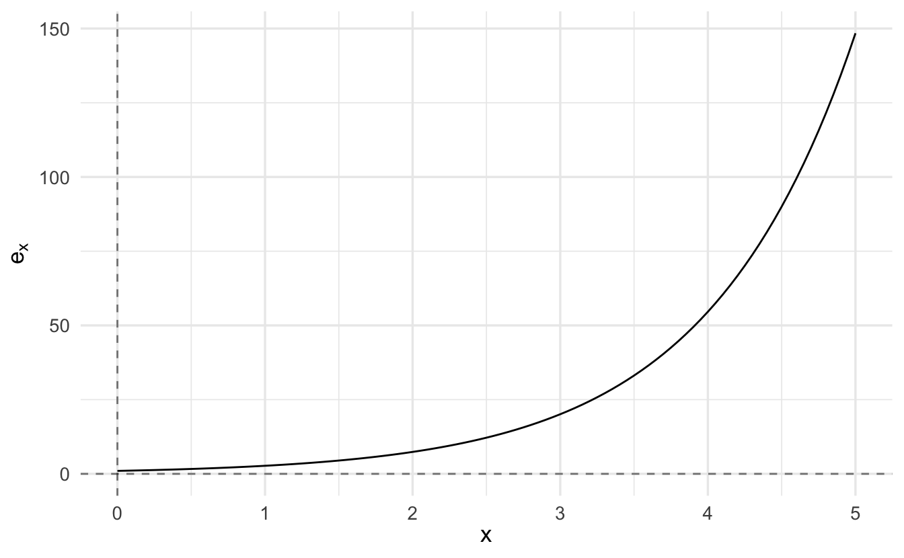

$$
\begin{aligned}
f(x) & =  e^{x} \\
f^{'}(x) & =  e^{x} \\
f^{''}(x) & =  e^{x} 
\end{aligned}
$$

##### Natural log (concave down)

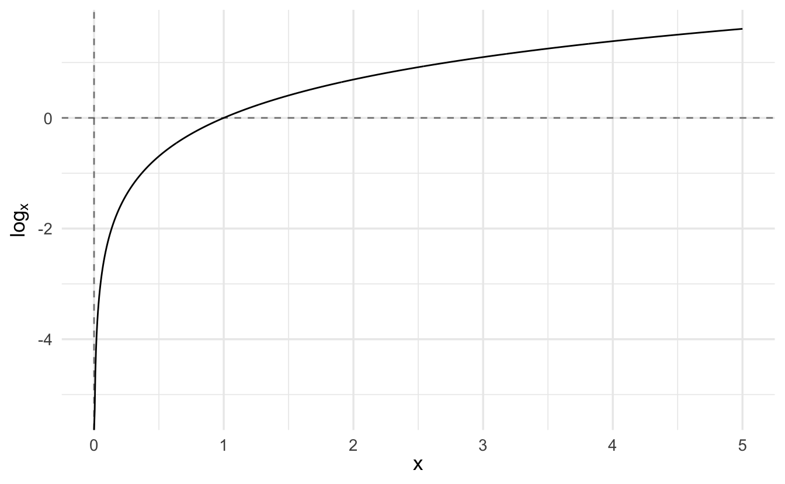

$$
\begin{aligned}
f(x) & =  \log(x) \\
f^{'}(x) & =  \frac{1}{x} \\
f^{''}(x) & =  -\frac{1}{x^2}
\end{aligned}
$$

## Extrema

**Extreme values** are values of a function that are either the maximum or minimum value.

::: {.theorem echo=TRUE name="Extreme value theorem"}
Suppose $f:[a, b] \rightarrow \Re$. There exists numbers $c$ and $d$ in $[a, b]$ such that $f(c) \ge f(x) \ge f(d)\quad\forall x\in [a,b]$. That is, $f$ must attain a maximum and a minimum, each at least once.

:::

These values can be locally or (potentially) globally across the entire domain of $f$.

### Minimum and maximum on the interval $[0,5]$ are located at the endpoints

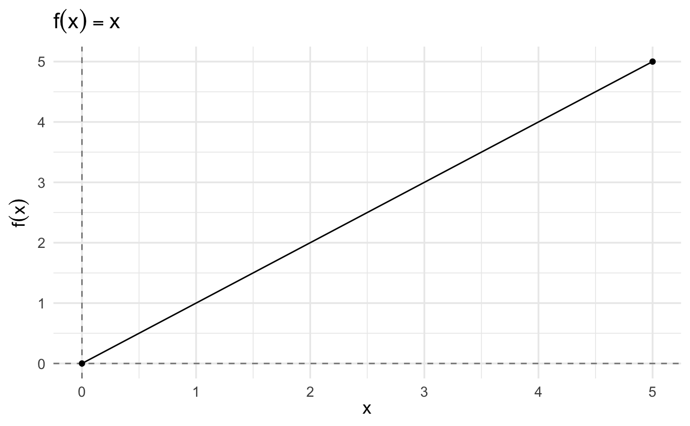

### Global maximum is located at $x=0$

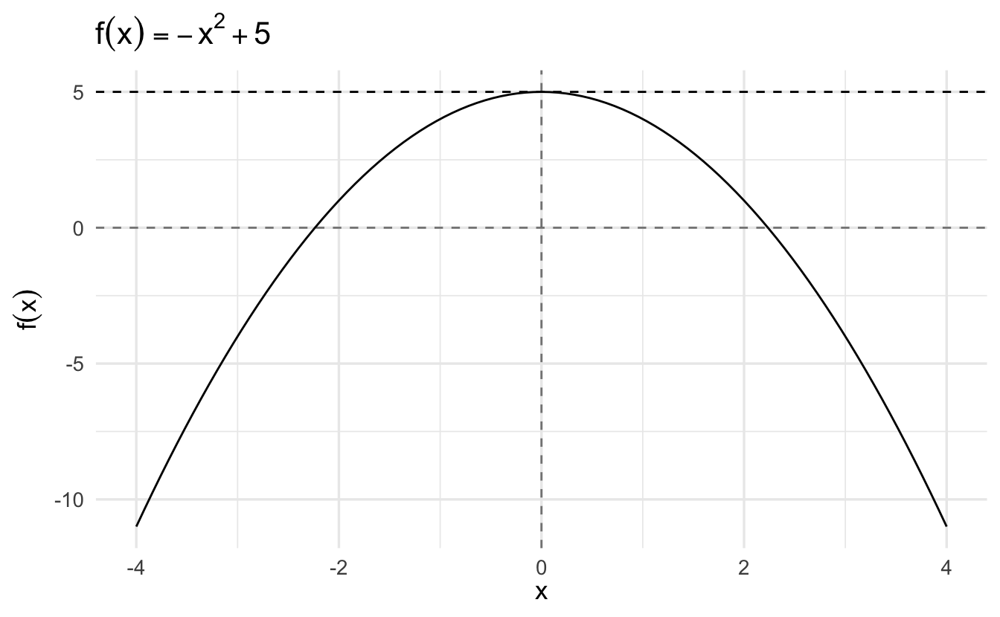

### Global minimum is located at $x= - \frac{9}{2}$

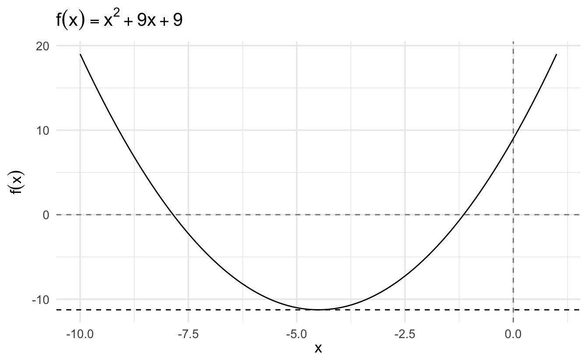

### A bunch of local minima and maxima

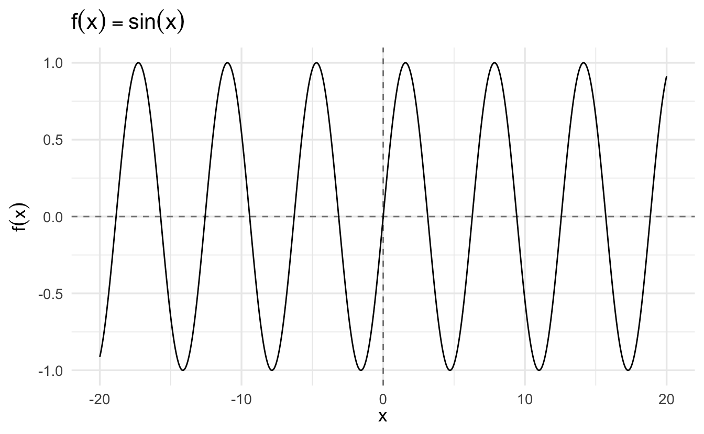

### $x=0$ is an inflection point that is neither a minimum nor a maximum ($f''(x) = 0$)

Also known as a **saddle point**.

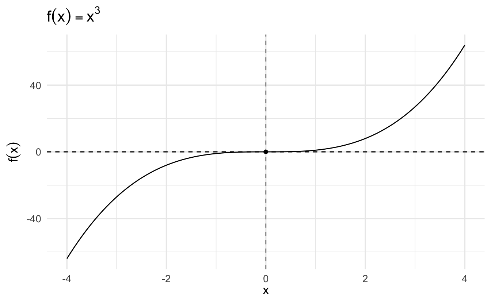

## Framework for analytical optimization

Here we see how critical points can be used to find extrema and saddle points.

1. Find $f'(x)$
1. Set $f'(x)=0$ and solve for $x$. Call all $x_0$ such that $f'(x_0)=0$ **critical values**
1. Find $f''(x)$. Evaluate at each $x_0$
    * If $f''(x) > 0$, concave up, and therefore a local minimum
    * If $f''(x) < 0$, concave down, and therefore a local maximum
    * If it's the global maximum/minimum, it will produce the largest/smallest value for $f(x)$
    * On a closed range along the domain, check the endpoints as well

### Example: $f(x) = -x^2$,  $x \in [-3, 3]$

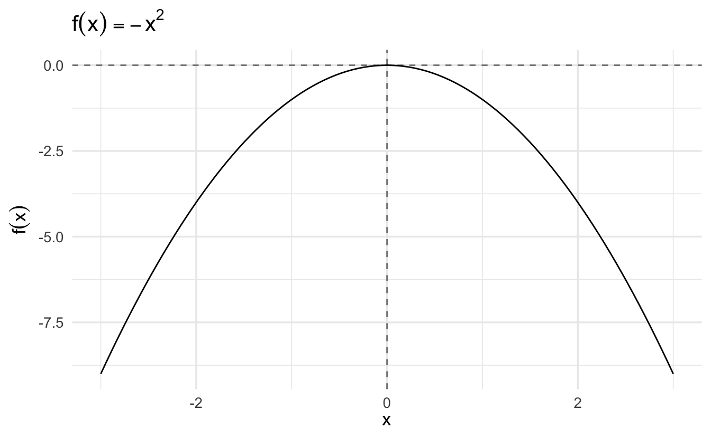

#### Critical Value

$$
\begin{eqnarray}
f'(x) & = & - 2 x  \\
0 & = & - 2 x^{*}  \\
x^{*} & = & 0 
\end{eqnarray}
$$

#### Second Derivative

$$
\begin{eqnarray}
f^{'}(x) & = & - 2x  \\
f^{''}(x)  & = & - 2  
\end{eqnarray}
$$

* $f^{''}(x)< 0$, local maximum

### Example: $f(x) = x^3$, $x \in [-3, 3]$

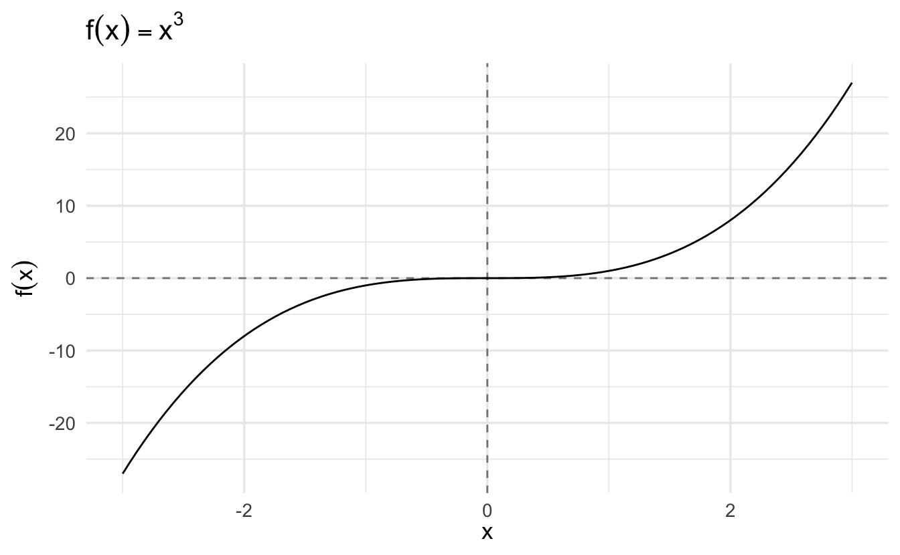

#### Critical Value

$$
\begin{eqnarray}
f'(x) & = & 3 x^2  \\
0 & = & 3 (x^{*})^2  \\
x^{*} & = & 0 
\end{eqnarray}
$$

#### Second Derivative

$$
\begin{eqnarray}
f^{''}(x) & = & 6x  \\
f^{''}(0)  & = & 0
\end{eqnarray}
$$

* Neither a minimum nor a maximum, it is a **saddle point**

### Example: spatial model

A large literature in Congress supposes legislators and policies can be situated in a **policy space**. Suppose legislator $i$ and policies $x, i \in \Re$. Define legislator $i$'s utility as, $U:\Re \rightarrow \Re$,

$$
\begin{aligned}
U_{i} (x) & = - (x - \mu)^{2} \\ 
U_{i}(x) & = - x^2 +  2 x \mu  - \mu^2
\end{aligned}
$$

What is $i$'s optimal policy over the range $x \in [\mu- 2, \mu + 2]$?

#### First derivative

$$
\begin{aligned}
U_{i}^{'} (x) & = -2 (x - \mu) \\
0 & = -2x^{*} + 2 \mu \\ 
x^{*} & = \mu
\end{aligned}
$$

#### Second derivative test

$$U^{''}_{i}(x) = -2 <0 \rightarrow \text{Concave Down}$$

We call $\mu$ legislator $i$'s **ideal point**

$$
\begin{aligned}
U_{i}(\mu) & = - (\mu - \mu)^2 = 0  \\
U_{i}(\mu - 2) & = - (\mu - 2 - \mu)^2 = -4  \\
U_{i} (\mu + 2) & = - (\mu + 2 - \mu)^2 = -4  
\end{aligned}
$$

The legislator maximizes her utility at $\mu$.

### Example: Maximum likelihood estimation

A **likelihood function** is a function for calculating the parameters of a statistical model, given specific observed data. As we'll see in a few days, likelihood is related to, but not the same as, probability. Under frequentist inference:

* Probability is the plausibility of a random outcome occurring, given a model parameter value
* Likelihood is the plausibility of a model parameter(s) value, given specific observed value

Generally in these problems the data is known but the parameters are unknown. In order to estimate the best values for the parameters, we can use optimization to **maximize** the function to find the values for the function located at the global maximum of the likelihood function.

Here is an example likelihood function. We want to find the **maximum likelihood estimate** for the function:^[Note that this is the likelihood function for a normal distribution with the variance parameter held constant. This allows us to eliminate the variance parameter from the equation and simplify the procedure. This process would work with both parameters, if we were doing partial derivatives and finding them simultaneously. [We'll revisit this soon.](multivariable-differentiation.html#maximum-likelihood-estimation-for-a-normal-distribution)]

$$
\begin{aligned}
f(\mu) & = \prod_{i=1}^{N} \exp( \frac{-(Y_{i} - \mu)^2}{ 2}) \\
& = \exp(- \frac{(Y_{1} - \mu)^2}{ 2}) \times \ldots \times \exp(- \frac{(Y_{N} - \mu)^2}{ 2}) \\
& = \exp( - \frac{\sum_{i=1}^{N} (Y_{i} - \mu)^2} {2})
\end{aligned}
$$

\BeginKnitrBlock{rmdnote}
$$\exp(x) \equiv e^{x}$$
  
$\exp()$ is a more compact notation used commonly when the exponent is a fractional value.
\EndKnitrBlock{rmdnote}

\BeginKnitrBlock{rmdnote}
* $\prod_{i=1}^{N}$ is the product over all observations.
* We can rewrite the function as the sum $\sum_{i=1}^{N} (Y_{i} - \mu)^2$ because of the multiplicative exponents rule.
\EndKnitrBlock{rmdnote}

This value will be very very very small (exponentiation to a negative exponent). Trying to find the maximum when $f(\mu)$ only has very slight changes across different values of $\mu$ is extremely difficult. However, suppose $f:\Re \rightarrow (0, \infty)$. If $x_{0}$ maximizes $f$, then $x_{0}$ maximizes $\log(f(x))$. That is, we don't need the exact value of the likelihood function, just the value for $\mu$ where it is maximized. That value $\mu^{*}$ will be the same for either function, so instead of maximizing the likelihood **we'll maximize the log-likelihood**.

$$
\begin{aligned}
\log f(\mu) & = \log \left( \exp( - \frac{\sum_{i=1}^{N} (Y_{i} - \mu)^2} {2}) \right)  \\
& = - \frac{\sum_{i=1}^{N} (Y_{i} - \mu)^2} {2} \\
	& = -\frac{1}{2} \left(\sum_{i=1}^{N} Y_{i}^2 - 2\mu \sum_{i=1}^{N} Y_{i} + N\times\mu^2 \right) \\
\frac{ \partial \log f(\mu) }{ \partial \mu } & = 		-\frac{1}{2} \left( - 2\sum_{i=1}^{N} Y_{i} + 2 N \mu \right) 
\end{aligned}
$$

* $\log{e^{f(x)}} = f(x)$
* Expand terms in the summation, then separate into separate terms
    * $\sum_{i = 1}^N \mu^1 = N \times \mu^2$
* Calculate the derivative
    * $\sum_{i=1}^{N} Y_{i}^2$ is a constant with respect to $\mu$ and drops out

$$
\begin{aligned}
0 & = -\frac{1}{2} \left( - 2 \sum_{i=1}^{N} Y_{i} + 2 N \mu^{*} \right) \\
0 & = \sum_{i=1}^{N} Y_{i} - N \mu^{*}  \\
N \mu^{*}  & =  \sum_{i=1}^{N}Y_{i} \\
\mu^{*} & = \frac{\sum_{i=1}^{N}Y_{i}}{N} \\
\mu^{*} & = \bar{Y}
\end{aligned}
$$

Apply the second derivative test:

$$
\begin{aligned}
f^{'}(\mu ) & = -\frac{1}{2} \left( - 2\sum_{i=1}^{N} Y_{i} + 2 N \mu \right) \\
f^{'}(\mu ) & = \sum_{i=1}^{N} Y_{i} - N \mu \\
f^{''}(\mu ) & = -N 
\end{aligned}
$$

$-N<0$, so the function is concave down at this point and therefore it is a **maximum**. The arithmetic mean of $Y$ is the maximum likelihood estimator for the variable.

## Computational optimization procedures

Analytic approaches can be difficult or impossible for most applications in the social sciences. Computational approaches simplify the problem through various forms of approximations. Different algorithms are available with benefits/drawbacks. Some examples include:

* Newton-Raphson - expensive
* Grid search - tedious
* Gradient descent - parallelizable

### Newton-Raphson root finding

**Roots** are values of the function $f(x)$ where $f(x) = 0$, where the function crosses the $x$-axis. Root solving is necessary to optimize a function since we first have to calculate the first derivative $f'(x)$, set it equal to 0, and solve for $x^{*}$.

However, this is not always a realistic method or easy to compute value. Instead, we can use general iterative procedures to **approximate** $x^{*}$, with decent reliability. **Newton's method** (also called **Newton-Raphson** or a **Newton-Raphson hill climber**) is one such procedure that relies on **Taylor series expansion** to iterate over a series of possible $x^{*}$ values until converging on the final estimate.

#### Tangent lines

Solving for $f(x) = 0$ can be challenging when $f(x)$ is a non-linear function. However, solving for $x$ when $f(x)$ is linear is relatively easy. If we can approximate the function $f(x)$ using linear functions, the problem becomes less difficult.

To start, we define the **tangent** at a point as the line through that point whose slope is the slope of the curve.

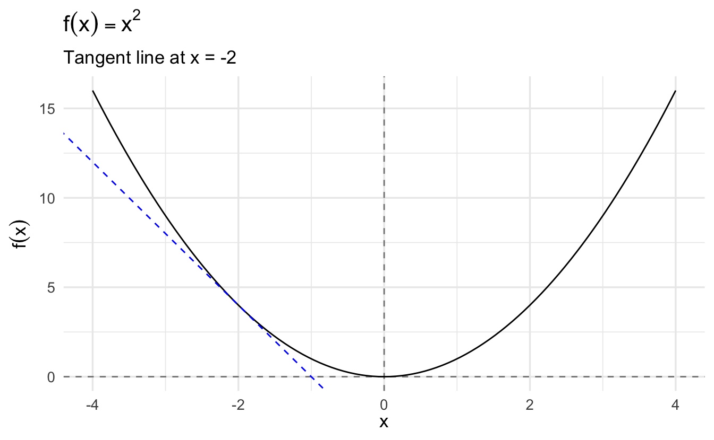

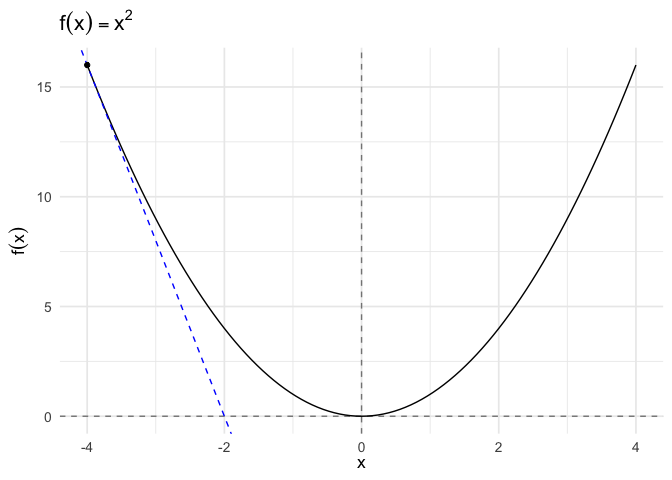

The formula for a tangent line at $x_0$ is:

$$g(x) = f^{'}(x_{0}) (x - x_{0} ) + f(x_{0})$$

We'll use the formula for a tangent line to generate updates.

#### Newton-Raphson method

Suppose we have some initial guess $x_{0}$. We're going to approximate $f(x)$ with the tangent line to generate a new guess:

$$
\begin{aligned}
g(x) & = f^{'}(x_{0})(x - x_{0} ) + f(x_{0} ) \\
0 & = f^{'}(x_{0}) (x_{1} - x_{0}) + f(x_{0} ) \\
x_{1} & =  x_{0} - \frac{f(x_{0}) }{f^{'}(x_{0})}
\end{aligned}
$$

The procedure is algorithmic and iterative because our initial guess for $x_1$ will not be optimal. However, we can use the same procedure multiple times substituting the new value for $x_1$ into the function as $x_0$ and updating $x_1$. Repeat this step sufficiently until $f(x_{j+1})$ is sufficiently close to zero, then stop.

#### Example: $y = -x^2$

Let's learn Newton's method using some arbitrary function. The only requirement we want to impose is that this function has to be twice differentiable (you will soon notice why). Say we want to optimize the following arbitrary function:

$$y = -x^2$$

The first derivative of this function is $\frac{\partial y}{\partial x} = -2x$.

The second derivative is $\frac{\partial^2 y}{\partial x^2} = -2$

This function looks like this:

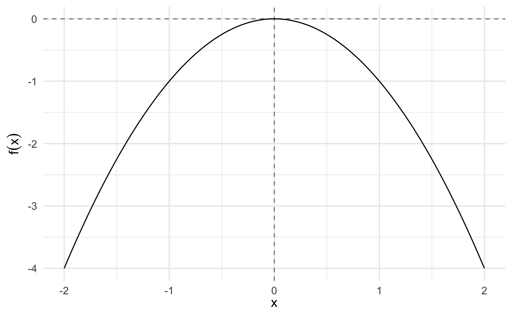

We want to use Newton-Raphson to find the critical point:

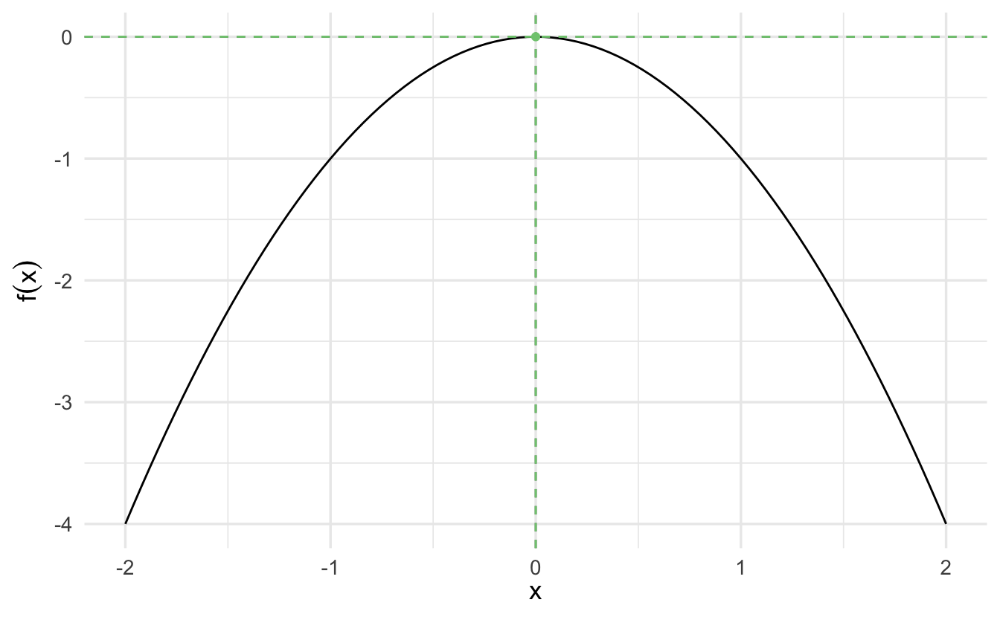

##### Implementing Newton-Raphson

Recall that given a starting value $x_0$, we determine the next guess of the optimum of our function $f(x)$ using the following equation:

$$x_1 = x_0 - \frac{f'(x_0)}{f''(x_0)}$$

\BeginKnitrBlock{rmdnote}
Here the base function is $f'(x_0)$ because we want to solve for the roots of $f'(x)$.
\EndKnitrBlock{rmdnote}

Or, more generally, for the $(n+1)^{th}$ guess, use

$$x_{n+1} = x_n - \frac{f'(x_n)}{f''(x_n)}$$

Given our function, 

$$x_{n+1} = x_n - \frac{-2x}{-2}$$

We want to continue looking for new guesses till the difference between a guess and the previous one is sufficiently small. For example, say we want to stick to a guess $x_n$ if $\mid x_n - x_{n-1} \mid < 0.0001$.

Let's find the maximum of our function. Let's start with a relatively high guess of $x_0 = 3$:

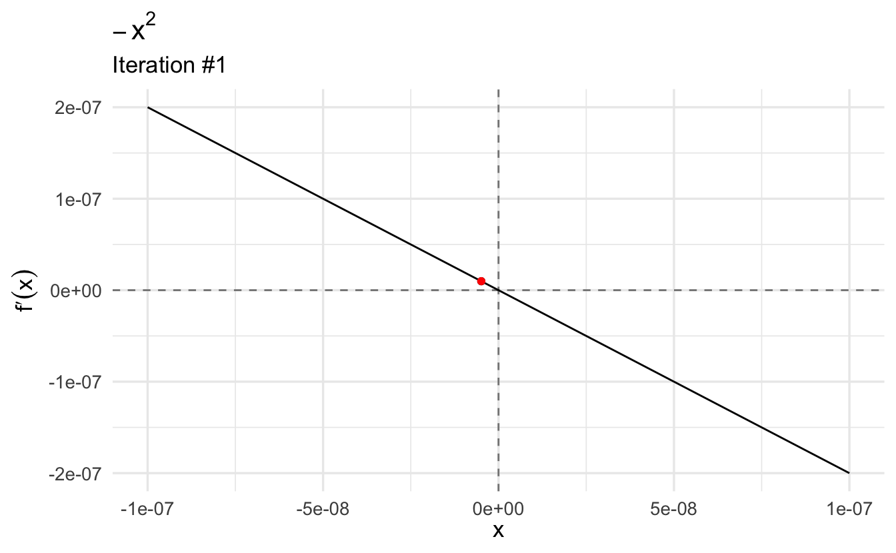

This gives us the maximum. If we plug it into the second derivative, we see that the value $-2$ is a local maximum because the second derivative evaluated at this point is negative. Moreover, we find that the first derivative evaluated at this point ($-2$) is (very close to) zero.

#### Example: $y = x^3 + 2x^2 - 3x + 4$

Now let's consider the function

$$y = x^3 + 2x^2 - 3x + 4$$

The first derivative of this function is $\frac{\partial y}{\partial x} =  3x^2 + 4x - 3$.

The second derivative is $\frac{\partial^2 y}{\partial x^2} = 6x + 4$

This function looks like this:

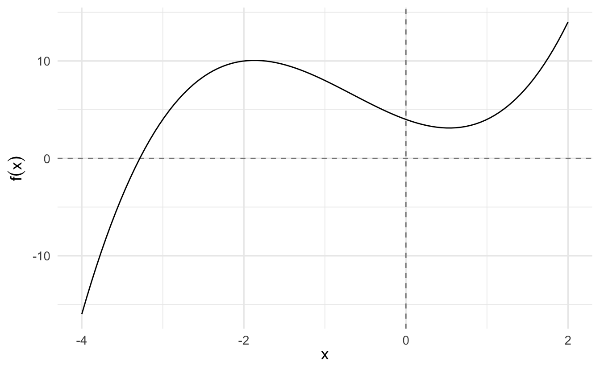

We want to use Newton-Raphson to find the following two points (optima):

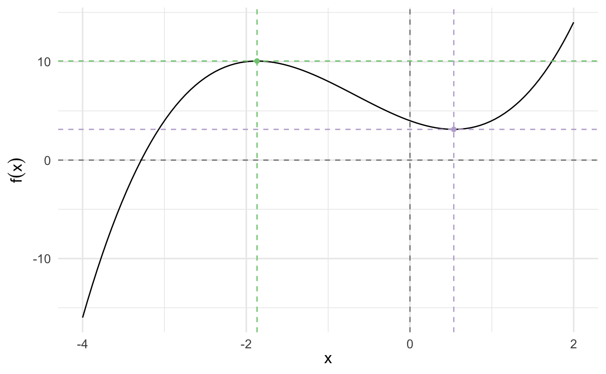

Given our function, 

$$x_{n+1} = x_n - \frac{3x_n^2 + 4x_n - 3}{6x_n + 4}$$

Let's start with an initial guess $x_0 = 10$:

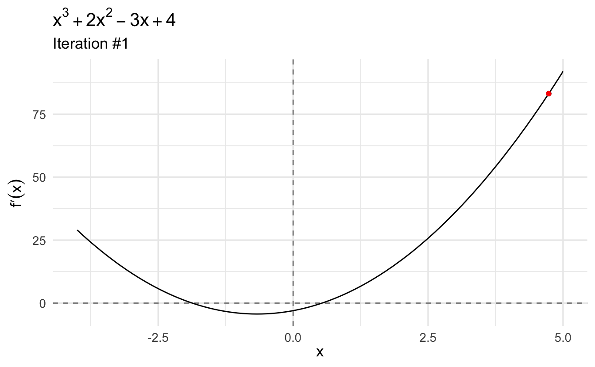

This gives us the first point: $x \approx 0.535$. If we plug it into the second derivative, we see that the value is a local minimum because the second derivative evaluated at this point is positive ($7.211$). Moreover, we find that the first derivative evaluated at this point ($4.441\times 10^{-16}$) is (very close to) zero.

However this function also has a second critical value: a local maximum. Let's try to find the second optimum by plugging a negative value ($x_0 = -10$) into our Newton-Raphson function:

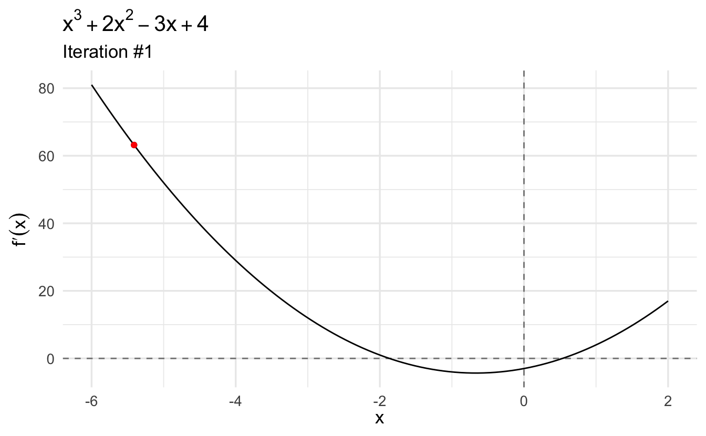

Again, we can plug in this point into second derivative to confirm that this is a local maximum ($-15.706$).

The key point here is that Newton-Raphson is not guaranteed to find a global minimum/maximum, nor is it even guaranteed to find a specific critical point. When you use this procedure, you should initialize the algorithm with several different $x_0$ to verify if they converge on the same or differing answers.

### Grid search

A **grid search** is an exhaustive search algorithm for maximizing/minimizing a function. It works by defining a specified set of $x_i$, calculating $f(x_i)$, and comparing all the resulting values to determine which is largest/smallest.

Consider again the function

$$y = -x^2$$

We can evaluate the function for all $x \in \{ -2, -1.99, -1.98, \ldots, 1.98, 1.99, 2 \}$ and determine which $x_i$ generates the largest value.

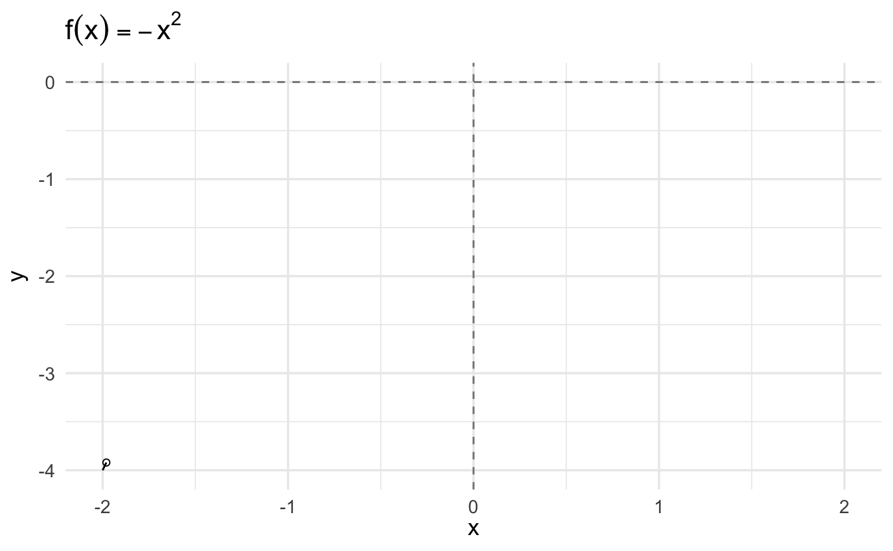

For a simple example such as this, the method works reasonably well. However it is also computationally inefficient as you have to calculate $f(x)$ for all reasonable values of $x$. If you do not have a reasonable starting point for your search, you have to search over an extremely large range of values. For this reason, grid searches -- while simple -- also tend to be disfavored.

### Gradient descent

Let's start with the function^[Source: http://ethen8181.github.io/machine-learning/linear_regression/linear_regession.html]

$$f(x) = 1.2 x^2 - 4.8 x + 8$$

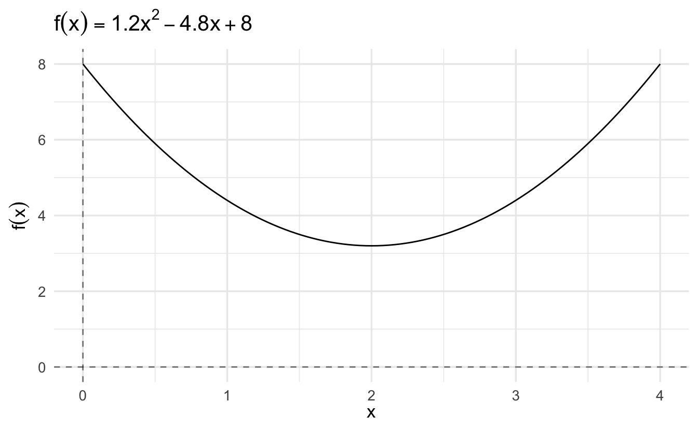

We could solve this analytically:

$$
\begin{aligned}
f'(x) &= 2.4x - 4.8 \\
0 &= 2.4x - 4.8 \\
4.8 &= 2.4x \\
x &= 2
\end{aligned}
$$

According to the second derivative test,

$$
\begin{aligned}
f''(x) &= 2.4 \\
f''(2) &= 2.4
\end{aligned}
$$

$f''(2) > 0$, so $x=2$ is a minimum. This is easy if the function is simple. If the function is complicated, we can use a technique called **gradient descent**.

$$
x_1 = x_0 - \alpha f'(x_0)
$$

* $f'(x)$ - first derivative (gradient) of the function
* $\alpha$ - learning rate (set manually)

Like Newton's method, gradient descent is an iterative algorithm. You repeat the process until the algorithm converges on a stable solution. Unlike Newton's method, the rate of learning is controlled by the first derivative and the learning rate, not the second derivative $f''(x)$.

Imagine gradient descent as when you're at the top of a mountain and you want to get down to the very bottom, you have to choose two things. First the direction you wish to descend and second the size of the steps you wish to take. After choosing both of these things, you will keep on taking that step size and that direction until you reach the bottom.

$\alpha$ corresponds to the size of the steps you wish to take and $f'(x)$ gives you the direction that you should take for your given formula. Note that in order for the formula to start calculating you will have to assign an initial value for $x$.

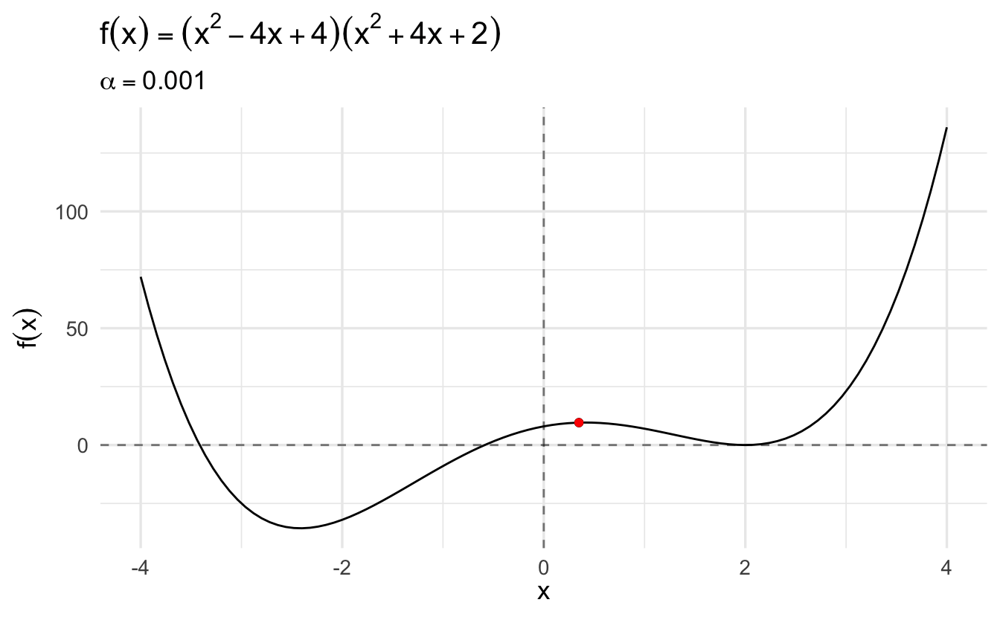

Compare this same function using gradient descent and a learning rate of $\alpha = 0.1$:

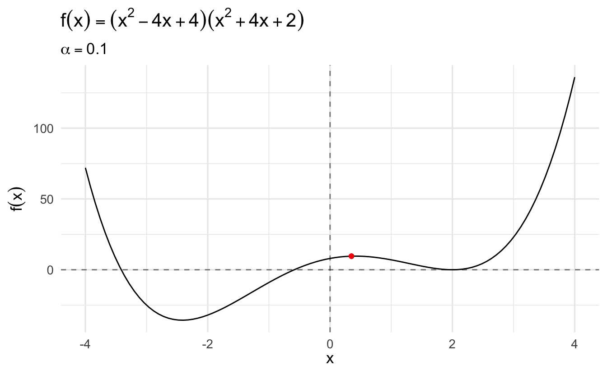

The algorithm converges more slowly the smaller the learning rate. In many contexts, you will use a different learning rate. A learning rate that is too high can cause the algorithm to converge too quickly to a suboptimal solution (such as a local minima as opposed to a global minima), whereas a learning rate that is too small can cause the process to get stuck. Consider the example below with a higher learning rate:

