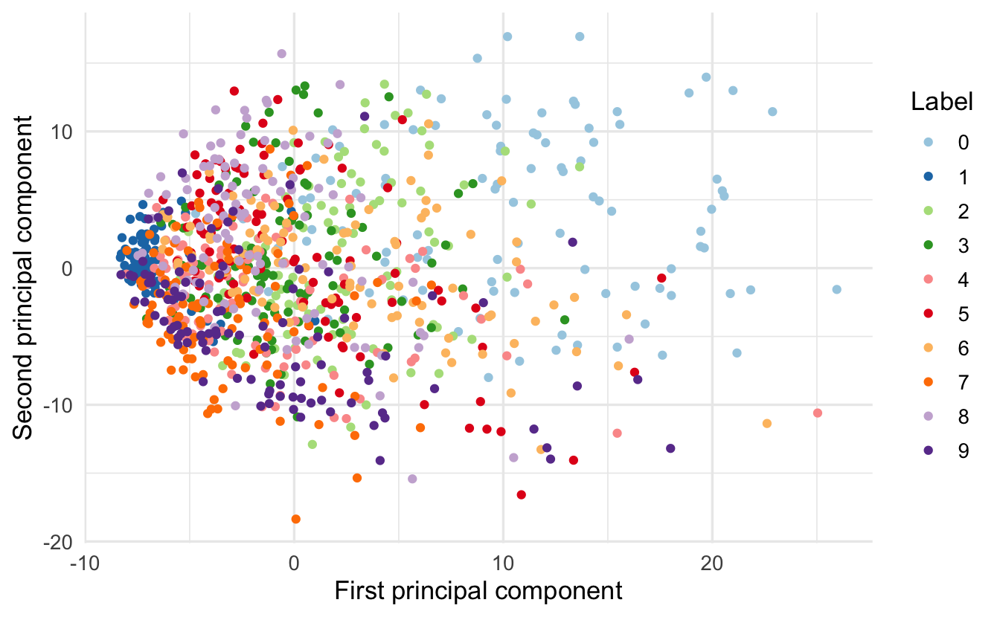

# Linear algebra {#linear-algebra}


## Learning objectives {-}

* Define vector and matrix
* Visualize vectors in multiple dimensions
* Demonstrate applicability of linear algebra to text analysis and cosine similarity
* Perform basic algebraic operations on vectors and matricies
* Generalize linear algebra to tensors and neural networks
* Define matrix inversion
* Demonstrate how to solve systems of linear equations using matrix inversion
* Define the determinant of a matrix
* Define matrix decomposition
* Explain singular value decomposition and demonstrate the applicability of matrix algebra to real-world problems

## Supplemental readings {-}

* Chapters 11-12, 13.1-.3, @pemberton2015
* [OpenStax Calculus: Volume 3, ch 2](https://openstax.org/details/books/calculus-volume-3)
* [OpenStax College Algebra, ch 7.5-.8](https://openstax.org/details/books/college-algebra)

## Linear algebra

A **matrix** is a rectangular array of numbers arranged in rows and columns.

<div class="figure" style="text-align: center">

<p class="caption">(\#fig:neo)Not that matrix.</p>
</div>

Many common statistical methods in the social sciences rely on data structured as matricies (e.g. ordinary least squares regression). As computational social science expands and data sources explode in complexity and scope, big data needs to be stored in processed in many higher dimensional spaces.

**Linear algebra** is the algebra of matricies. It allows us to examine the geometry of high dimensional space, and expand calculus into functions with multiple variables. It is very important for regression/machine learning/deep learning methods you will encounter in your coursework and research.

## Points and vectors

### Points

* A point exists in a single dimension (in $\Re^1$)
    * $1$
    * $\pi$
    * $e$
* An ordered pair exists in two dimensions ($\Re^2 = \Re \times \Re$)
    * $(1,2)$
    * $(0,0)$
    * $(\pi, e)$
* An ordered triple in three dimensions ($\Re^3 = \Re \times \Re \times \Re$)
    * $(3.1, 4.5, 6.1132)$
* An ordered $n$-tuple in $n$-dimensions $R^n = \Re \times \Re \times \ldots \times \Re$
    * $(a_{1}, a_{2}, \ldots, a_{n})$

### Vectors

A point $\mathbf{x} \in \Re^{n}$ is an ordered n-tuple, $(x_{1}, x_{2}, \ldots, x_{n})$. The **vector** $\mathbf{x} \in \Re^{n}$ is the arrow pointing from the origin $(0, 0, \ldots, 0)$ to $\mathbf{x}$.

### One dimensional example


### Two dimensional example


### Three dimensional example

* (Latitude, Longitude, Elevation)
* $(1,2,3)$
* $(0,1,2)$

### $N$-dimensional example

* Individual campaign donation records
    $$\mathbf{x} = (1000, 0, 10, 50, 15, 4, 0, 0, 0, \ldots, 2400000000)$$
* U.S. counties' proportion of vote for Donald Trump
    $$\mathbf{y} = (0.8, 0.5, 0.6, \ldots, 0.2)$$
* Run experiment, assess feeling thermometer of elected official
    $$\mathbf{t} = (0, 100, 50, 70, 80, \ldots, 100)$$ 

### Examples of some basic arithmetic

#### Vector/scalar addition/multiplication

Suppose:

$$
\begin{aligned}
\mathbf{u} & =  (1, 2, 3, 4, 5)  \\
\mathbf{v} & =  (1, 1, 1, 1, 1)  \\
k & =  2
\end{aligned}
$$

Then, 

$$
\begin{aligned}
\mathbf{u}  + \mathbf{v} & = (1 + 1, 2 + 1, 3+ 1, 4 + 1, 5+ 1)  = (2, 3, 4, 5, 6) \\
k \mathbf{u} & = (2 \times 1, 2 \times 2, 2 \times 3, 2 \times 4, 2 \times 5) = (2, 4, 6, 8, 10)  \\
k \mathbf{v} & = (2 \times 1,2 \times 1,2 \times 1,2 \times 1,2 \times 1) = (2, 2, 2, 2, 2)
\end{aligned}
$$

### Linear dependence

Expressions such as $\mathbf{a} + \mathbf{b}$ and $2\mathbf{a} - 3\mathbf{b}$ are examples of **linear combinations** of vectors $\mathbf{a}$ and $\mathbf{b}$. Generally, a linear combination of two vectors $\mathbf{a}$ and $\mathbf{b}$ is a vector of the form $\alpha \mathbf{a} + \beta\mathbf{b}$, where $\alpha, \beta$ are scalars. This form extends to linear combinations of more than two vectors

$$\alpha \mathbf{a} + \beta\mathbf{b} + \gamma\mathbf{c} + \delta\mathbf{d} + \ldots$$

Suppose we have a set of $k$ $n$-vectors $\mathbf{b}^1, \mathbf{b}^2, \ldots \mathbf{b}^k$. We say that the vectors $\mathbf{b}^1, \mathbf{b}^2, \ldots \mathbf{b}^k$ are **linearly independent** if they are not linearly dependent; thus, $\mathbf{b}^1, \mathbf{b}^2, \ldots \mathbf{b}^k$ are linearly independent if none of the vectors can be expressed as a linear combination of the others.

#### Example of linear dependence

$$\mathbf{a} = \begin{bmatrix}
3 \\
1
\end{bmatrix}, \quad \mathbf{b} = \begin{bmatrix}
2 \\
2
\end{bmatrix}, \quad \mathbf{c} = \begin{bmatrix}
1 \\
3
\end{bmatrix}$$

It is obvious that $\mathbf{b} = \frac{1}{2} (\mathbf{a} + \mathbf{c})$. Therefore the vectors $\mathbf{a}, \mathbf{b}, \mathbf{c}$ are linearly dependent.

#### Detecting linear dependence

A simple criterion for linear dependence is the following: $\mathbf{b}^1, \mathbf{b}^2, \ldots \mathbf{b}^k$ are linearly dependent if and only if there exist scalars $\alpha_1, \alpha_2, \ldots, \alpha_k$ *not all zero* such that

$$\alpha_1 \mathbf{b}^1 + \alpha_2 \mathbf{b}^2 + \ldots + \alpha_k \mathbf{b}^k = \mathbf{0}$$

##### Example 1

Consider the vectors

$$\mathbf{a} = \begin{bmatrix}
2 \\
1 \\
2
\end{bmatrix}, \quad \mathbf{b} = \begin{bmatrix}
4 \\
1 \\
3
\end{bmatrix}, \quad \mathbf{c} = \begin{bmatrix}
1 \\
1 \\
2
\end{bmatrix}$$

Suppose there are scalars $\alpha, \beta, \gamma$ such that

$$\alpha\mathbf{a} + \beta\mathbf{b} + \gamma\mathbf{c} = \mathbf{0}$$

We can express this as a **system of equations**:

$$
\begin{aligned}
2\alpha &+ 4\beta &+ \gamma &= 0 \\
\alpha &+ \beta &+ \gamma &= 0 \\
2\alpha &+ 3\beta &+ 2\gamma &= 0
\end{aligned}
$$

We can solve this system of equations by reducing it down until one equation has just a single term remaining. For instance, eliminate $\alpha$ from the second and third equations by subtracting from those equations suitable multiples of the first equation:

$$
\begin{aligned}
2\alpha &+ 4\beta &+ \gamma &= 0 \\
 &- \beta &+ \frac{1}{2}\gamma &= 0 \\
 &- \beta &+ \gamma &= 0
\end{aligned}
$$

Next, eliminate $\beta$ from the third equation by subtracting a suitable multiple of the second:

$$
\begin{aligned}
2\alpha &+ 4\beta &+ \gamma &= 0 \\
 &- \beta &+ \frac{1}{2}\gamma &= 0 \\
 & &+ \frac{1}{2} \gamma &= 0
\end{aligned}
$$

We can now use **back-substitution** to solve for $\gamma$, then plug in that value to solve for $\beta$ and $\alpha$. Since the output of each equation is $0$, this reduces down to $\gamma = \beta = \alpha = 0$, so the vectors $\mathbf{a}, \mathbf{b}, \mathbf{c}$ are linearly independent.

##### Example 2

Consider the vectors

$$\mathbf{a} = \begin{bmatrix}
2 \\
1 \\
2
\end{bmatrix}, \quad \mathbf{b} = \begin{bmatrix}
4 \\
1 \\
3
\end{bmatrix}, \quad \mathbf{c} = \begin{bmatrix}
2 \\
2 \\
3
\end{bmatrix}$$

Suppose there are scalars $\alpha, \beta, \gamma$ such that

$$\alpha\mathbf{a} + \beta\mathbf{b} + \gamma\mathbf{c} = \mathbf{0}$$

Express this as a system of equations:

$$
\begin{aligned}
2\alpha &+ 4\beta &+ 2\gamma &= 0 \\
\alpha &+ \beta &+ 2\gamma &= 0 \\
2\alpha &+ 3\beta &+ 3\gamma &= 0
\end{aligned}
$$

Let's try to eliminate $\alpha$ in the last two equations by subtracting multiples of the first equation:

$$
\begin{aligned}
2\alpha &+ 4\beta &+ 2\gamma &= 0 \\
 &- \beta &+ \gamma &= 0 \\
 &- \beta &+ \gamma &= 0
\end{aligned}
$$

We can cancel out the third equation to be $0 = 0$, leaving us with

$$
\begin{aligned}
2\alpha &+ 4\beta &+ 2\gamma &= 0 \\
 &- \beta &+ \gamma &= 0
\end{aligned}
$$

We could find the complete solution by assigning an arbitrary value to $\gamma$ and then finding $\beta$ and $\alpha$. However, simply putting $\gamma = 1$ leads to $\beta = 1$ and $\alpha = -3$. We have thus found non-zero values for $\alpha, \beta, \gamma$, not all zero, such that $\alpha\mathbf{a} + \beta\mathbf{b} + \gamma\mathbf{c} = \mathbf{0}$. Therefore the vectors $\mathbf{a}, \mathbf{b}, \mathbf{c}$ are linearly dependent.

### Inner product

The **inner product**, also known as the **dot product**, of two vectors results in a **scalar** (a single value). Suppose $\mathbf{u} \in \Re^{n}$ and $\mathbf{v} \in \Re^{n}$. The inner product $\mathbf{u} \cdot \mathbf{v}$ is the sum of the item-by-item products:

$$
\begin{aligned}
\mathbf{u} \cdot \mathbf{v} &=  u_{1} v_{1} + u_{2}v_{2} + \ldots + u_{n} v_{n}  \\
														& =  \sum_{i=1}^{N} u_{i} v_{i} 
\end{aligned}
$$

Suppose $\mathbf{u} = (1, 2, 3)$ and $\mathbf{v} = (2, 3, 1)$. Then:

$$
\begin{aligned}
\mathbf{u} \cdot \mathbf{v} & =  1 \times 2 +  2 \times 3 +  3 \times 1 \\
				& = 2+ 6 + 3 \\
				& = 11				
\end{aligned}
$$

### Calculating vector length

The standard measurement for length of a vector is known as the **vector norm**. To illustrate, consider a vector in $\Re^2$:


The **Pythagorean Theorem** states that for a right triangle with sides length $a$ and $b$, the length of the hypotenuse $c = \sqrt{a^2 + b^2}$. So if $c$ is a vector in $\Re^2$, we can directly apply the Pythagorean Theorem to calculate its length from the origin $(0,0)$. We are guaranteed a right triangle because $a$ and $b$ simply correspond to the first and second scalar values contained in $c$ (i.e. $(3, 4)$).

This generalizes to $\Re^n$ as given by:

$$
\begin{aligned}
\| \mathbf{v}\| & = (\mathbf{v} \cdot \mathbf{v} )^{1/2} \\
						   & = (v_{1}^2 + v_{2}^{2} + v_{3}^{2} + \ldots + v_{n}^{2} )^{1/2}
\end{aligned}
$$

So to calculate the vector norm of a three-dimensional vector $\mathbf{x} = (1,1,1)$:

$$
\begin{aligned}
\| \mathbf{x}\| & = (\mathbf{x} \cdot \mathbf{x} )^{1/2} \\
						   & = (x_{1}^2 + x_{2}^{2} + x_{3}^{2})^{1/2} \\
						   & = (1 + 1 + 1)^{1/2} \\
						   &= \sqrt{3}
\end{aligned}
$$

## Example: text analysis

Text analysis is a common research method in the social sciences. In order to computationally analyze documents, we need to store them in a meaningful format. This does not mean the format is human-readable, simply interpretable by a computer. In the most simplistic form, documents are represented as vectors, and each value counts the frequency a word appears in a given document. While we throw away information such as word order, we can represent the information in a mathematical fashion using a vector.

```
 a abandoned abc ability able about above abroad absorbed absorbing abstract
43         0   0       0    0    10     0      0        0         0        1
```

Mathematically, this is represented by the vector $(43,0,0,0,0,10,\dots)$

Consider two hypothetical documents:

$$
\begin{aligned}
\text{Doc1} & = (1, 1, 3, \ldots, 5) \\
\text{Doc2} & = (2, 0, 0, \ldots, 1) \\
\textbf{Doc1}, \textbf{Doc2} & \in \Re^{M}
\end{aligned}
$$

where each vector is length $m$. Linear algebra provides many potentially useful operations. For example, the **inner product** between documents is:

$$
\begin{aligned}
\textbf{Doc1} \cdot \textbf{Doc2}  &  =  (1, 1, 3, \ldots, 5) (2, 0, 0, \ldots, 1)'  \\
 & =  1 \times 2 + 1 \times 0 + 3 \times 0 + \ldots + 5 \times 1 \\
& = 7 
\end{aligned}
$$

The **length** of a document is:

$$
\begin{aligned}
\| \textbf{Doc1} \| & \equiv  \sqrt{ \textbf{Doc1} \cdot \textbf{Doc1} } \\
 & =  \sqrt{(1, 1, 3, \ldots , 5) (1, 1, 3, \ldots, 5)' } \\
  & =  \sqrt{1^{2} +1^{2} + 3^{2} + 5^{2} } \\
   & =   6
\end{aligned}
$$

The **cosine** of the angle between the documents:

$$
\begin{aligned}
\cos (\theta) & \equiv  \left(\frac{\textbf{Doc1} \cdot \textbf{Doc2}}{\| \textbf{Doc1}\| \|\textbf{Doc2} \|} \right) \\
 & = \frac{7} { 6 \times  2.24} \\
  & = 0.52
\end{aligned}
$$

\BeginKnitrBlock{rmdnote}<div class="rmdnote">Remember $\cos(\theta)$ is the ratio of the length of the sides of a right triangle $\dfrac{a}{c}$.</div>\EndKnitrBlock{rmdnote}

What is the purpose of this property? What does this value tell us? It tells us the **similarity** in vector space between the documents.

Measuring similarity between documents is very useful. These methods have been used for:

* Assessing potential plagiarism
* Comparing similarity of legislative texts

What properties should a similarity measure have?

* The **maximum** should be the document with itself
* The **minimum** should be documents which have no words in common (i.e. **orthogonal**)
* Increasing when more of the same words are used
* Normalized for document length

### Measure 1: inner product

Consider if we used the inner product to measure similarity.

$$(2,1) \cdot (1,4) = 6$$


The problem is that the inner product is length dependent. Consider the same method calculated for the vector in purple:


$$(4,2) \cdot (1,4) = 12$$

We get different measures of similarity, yet is the new document really that different? We want something more consistent that accounts for varying overall document length.

### Measure 2: cosine similarity


$$
\begin{aligned}
(4,2) \cdot (1,4) &= 12 \\
\mathbf{a} \cdot \mathbf{b} &= \|\mathbf{a} \| \times \|\mathbf{b} \| \times \cos(\theta) \\
\frac{\mathbf{a} \cdot \mathbf{b}}{\|\mathbf{a} \| \times \|\mathbf{b} \|}  &= \cos(\theta)
\end{aligned}
$$

$\cos(\theta)$ removes document length from the similarity measure.

$$
\begin{aligned}
\cos (\theta) & \equiv  \left(\frac{\textbf{Doc1} \cdot \textbf{Doc2}}{\| \textbf{Doc1}\| \|\textbf{Doc2} \|} \right) \\
 & = \frac{(2, 1) \cdot (1, 4)} {\| (2,1)\| \| (1,4) \|} \\
 & = \frac{6} {(\sqrt{2^2 + 1^2}) (\sqrt{1^2 + 4^2})} \\
 & = \frac{6} {(\sqrt{5}) (\sqrt{17})} \\
  & \approx 0.65
\end{aligned}
$$

$$
\begin{aligned}
\cos (\theta) & \equiv  \left(\frac{\textbf{Doc3} \cdot \textbf{Doc2}}{\| \textbf{Doc3}\| \|\textbf{Doc2} \|} \right) \\
 & = \frac{(4,2) \cdot (1, 4)} {\| (24,2)\| \| (1,4) \|} \\
 & = \frac{12} {(\sqrt{4^2 + 2^2}) (\sqrt{1^2 + 4^2})} \\
 & = \frac{12} {(\sqrt{20}) (\sqrt{17})} \\
  & \approx 0.65
\end{aligned}
$$

This measure works for documents of any length with any unique number of words.

## Matricies

A **matrix** is a rectangular arrangement (array) of numbers defined by two **axes** (colloquially known as dimensions):

1. Rows
1. Columns

\BeginKnitrBlock{rmdnote}<div class="rmdnote">**Dimension** is sometimes used interchangably to describe the length of a vector and the number of axes in an array. It can be somewhat confusing. A dimension could refer to the number of entries along a specific axis or the number of axes in the array (tensor).</div>\EndKnitrBlock{rmdnote}

$$
\mathbf{A} =
\begin{array}{rrrr}
a_{11} & a_{12} & \ldots & a_{1n} \\
a_{21} & a_{22} & \ldots & a_{2n} \\
\vdots & \vdots & \ddots & \vdots \\
a_{m1} & a_{m2} & \ldots & a_{mn} \\
\end{array} 
$$

If $\mathbf{A}$ has $m$ rows $n$ columns we will say that $\mathbf{A}$ is an $m \times n$ matrix. Suppose $\mathbf{X}$ and $\mathbf{Y}$ are $m \times n$ matrices. Then $\mathbf{X} = \mathbf{Y}$ if  $x_{ij} = y_{ij}$ for all $i$ and $j$.

#### Simple examples

$$
\mathbf{X} = \left[ \begin{array}{rrr}
1 & 2 & 3 \\
2 & 1 & 4 \\
\end{array} \right]
$$

$\mathbf{X}$ is an $2 \times 3$ matrix.

$$
\mathbf{Y} = \left[ \begin{array}{rr}
1 & 2 \\
3 & 2 \\
1 & 4 \\
\end{array} \right]
$$

$\mathbf{Y}$ is an $3 \times 2$ matrix. $\mathbf{X} \neq \mathbf{Y}$ because the dimensions are different.

### Basic arithmetic

#### Addition

##### Matrix

Suppose $\mathbf{X}$ and $\mathbf{Y}$ are $m \times n$ matrices. Then:

$$
\begin{aligned} 
\mathbf{X} + \mathbf{Y} & =  \begin{bmatrix} 
x_{11} & x_{12} & \ldots & x_{1n} \\
x_{21} & x_{22} & \ldots & x_{2n} \\
\vdots & \vdots & \ddots & \vdots \\
x_{m1} & x_{m2} & \ldots & x_{mn} \\
\end{bmatrix} + 
\begin{bmatrix} 
y_{11} & y_{12} & \ldots & y_{1n} \\
y_{21} & y_{22} & \ldots & y_{2n} \\
\vdots & \vdots & \ddots & \vdots \\
y_{m1} & y_{m2} & \ldots & y_{mn} \\
\end{bmatrix}
 \\
& = \begin{bmatrix} 
x_{11} + y_{11} & x_{12} + y_{12} & \ldots & x_{1n} + y_{1n} \\
x_{21} + y_{21} & x_{22} + y_{22} & \ldots & x_{2n} + y_{2n} \\
\vdots & \vdots & \ddots & \vdots\\
x_{m1} + y_{m1} & x_{m2} + y_{m2} & \ldots & x_{mn} + y_{mn} \\
\end{bmatrix} 
\end{aligned}
$$

##### Scalar

Suppose $\mathbf{X}$ is an $m \times n$ matrix and $k \in \Re$. Then:

$$
\begin{aligned}
k \mathbf{X} & =  \begin{bmatrix} 
k x_{11} & k x_{12} & \ldots &  k x_{1n} \\
k x_{21} & k x_{22} & \ldots & k x_{2n} \\
\vdots & \vdots & \ddots & \vdots \\
k x_{m1} & k x_{m2} & \ldots & k x_{mn} \\
\end{bmatrix}
\end{aligned}
$$

### Transposition

Matricies must be conformable in order to perform certain operations. For example, matrix addition requires matricies to possess the same number of rows $m$ and columns $n$ in order to add each element together. If the second matrix instead has $n$ rows and $m$ columns, we can **transpose** it to flip the dimensionality of the matrix.

$$
\begin{aligned}
\mathbf{X} & = \begin{bmatrix}
x_{11} & x_{12} & \ldots & x_{1n} \\
x_{21} & x_{22} & \ldots & x_{2n} \\
\vdots & \vdots & \ddots & \vdots \\
x_{m1} & x_{m2} & \ldots & x_{mn} \\
\end{bmatrix} \\
\mathbf{X}' & =  \begin{bmatrix} 
x_{11} & x_{21} & \ldots & x_{m1} \\
x_{12} & x_{22} & \ldots & x_{m2} \\
\vdots & \vdots & \ddots & \vdots \\
x_{1n} & x_{2n} & \ldots & x_{mn}
\end{bmatrix}
\end{aligned}
$$

* If $\mathbf{X}$ is an $m \times n$ then $\mathbf{X}'$ is $n \times m$
* If $\mathbf{X} = \mathbf{X}'$ then we say $\mathbf{X}$ is symmetric
    * Only square matricies can be symmetric

### Multiplication

**Matrix multiplication** is extraordinarily useful for many computational problems, though somewhat tedious to calculate by hand. Suppose we have two matrices:

$$\mathbf{X} = \begin{bmatrix} 1 & 1 \\ 1& 1 \\ \end{bmatrix} , \quad \mathbf{Y} = \begin{bmatrix} 1 & 2 \\ 3 & 4 \\ \end{bmatrix} $$

We will create a new matrix $\mathbf{A}$ by matrix multiplication:

$$
\begin{aligned} 
\mathbf{A} & = \mathbf{X} \mathbf{Y} \\
& = \begin{bmatrix}
1 & 1 \\ 
1 & 1 \\
\end{bmatrix}
\begin{bmatrix}
1 & 2 \\
3 & 4 \\
\end{bmatrix} \\
&= \begin{bmatrix}
1 \times 1 + 1 \times 3 & 1 \times 2 + 1 \times 4 \\
1 \times 1 + 1 \times 3 & 1 \times 2 + 1 \times 4\\
\end{bmatrix} \\
&= \begin{bmatrix}
4 & 6 \\
4 & 6
\end{bmatrix}
\end{aligned}
$$

#### Algebraic properties

* Matricies must be **conformable** - that is, the number of columns in $\mathbf{A}$ must equal the number of rows in $\mathbf{B}$. If $\mathbf{AB}$ exists then we call the matricies conformable.
* Associative property: $(\mathbf{XY})\mathbf{Z} = \mathbf{X}(\mathbf{YZ})$
* Additive distributive property: $(\mathbf{X} + \mathbf{Y})\mathbf{Z} = \mathbf{XZ} + \mathbf{YZ}$
* Zero property: $\mathbf{X0} = 0$
* Order matters: $\mathbf{XY} \neq \mathbf{YX}$
    * Different from scalar multiplication: $xy = yx$

## Example: neural networks

Why should we care about vectors/matricies and arithmetic operations? What use are they to computational social science? I'm glad you asked! Vectors/matricies and linear algebra form the heart of a **neural network**.

<div class="figure" style="text-align: center">

<p class="caption">(\#fig:neural-network)Source: [Wikipedia](https://en.wikipedia.org/wiki/Neural_network)</p>
</div>

**Deep learning** is the name we use for **stacked neural networks**; that is, networks composed of several layers. The layers are made of **nodes.** A node is just a place where computation happens, loosely patterned on a neuron in the human brain, which fires when it encounters sufficient stimuli.^[Source: [A Beginner's Guide to Neural Networks and Deep Learning](https://skymind.ai/wiki/neural-network)]

A node combines input from the data with a set of coefficients, or weights, that either amplify or dampen that input, thereby assigning significance to inputs with regard to the task the algorithm is trying to learn; e.g. which input is most helpful is classifying data without error? These input-weight products are summed and then the sum is passed through a node's so-called activation function, to determine whether and to what extent that signal should progress further through the network to affect the ultimate outcome, say, an act of classification. If the signals passes through, the neuron has been "activated."

### How are neural networks used

* Self-driving cars
* Voice activated assistants
* Automatic machine translation
* Image recognition
* Detection of diseases

### How are neural networks related to linear algebra?

\BeginKnitrBlock{rmdnote}<div class="rmdnote">This section draws heavily from @francois2017. I highly encourage this text (especially chapter 2) for an intuitive introduction to deep learning and its mathematical building blocks.</div>\EndKnitrBlock{rmdnote}

A **tensor** is the core unit of data in deep learning. It is a generalization of vectors and matricies to higher-dimensions.

* Scalars (0D tensors) - a tensor containing a single number
* Vectors (1D tensors) - a tensor with a one-dimensional array of numbers
* Matricies (2D tensors) - a tensor with a two-dimensional array of numbers
* 3D tensors and higher-dimensional tensors - array of matricies

#### Tensor operations

All transformations inside of a deep neural network are reduced to a handful of **tensor operations**, or generalizations of matrix operations (e.g. addition, multiplication). The key point is if you can do it with a matrix, you can do it with a tensor.

#### Geometric interpretation

* Deep learning is a chain of small tensor operations which are geometric transformations of the input data
* We could interpret it as a very complex geometric transformation in a high-dimensional space, implemented via a long series of simple steps


* Consider two pieces of paper - one red and one blue
* Stick them together and crumple them into a small ball
    * The crumpled paper ball is the input data
    * Each sheet of paper is a class of data
    * We want to classify points on the paper as red or blue
* Deep learning is then the series of steps necessary to uncrumple the ball so that the two classes are cleanly separable again

#### Here is the linear algebra

Mathematically, each layer in the network example transforms input data as follows:

$$\mathbf{Y} = \text{activation}(\mathbf{W} \cdot \mathbf{X} + \mathbf{B})$$

* $\mathbf{X}$ - input tensor
* $\mathbf{Y}$ - output tensor
* $\mathbf{W}, \mathbf{B}$ - weight/parameter tensors (attributes of the layer, determined through the optimization process)
* $\text{activation}()$
    * Modifies the input in a non-linear fashion to allow for non-linear relationships between features/independent variables in the data
    * Key traits
        * Non-linear
        * Continuously differentiable
        * Fixed range
    * Common activation functions
        * Rectified Linear Units (RELU)
        
            $$R(z) = \max(0, z)$$
            
        * Sigmoid function (aka logistic regression)
        
            $$S(z) = \frac{1}{1 + e^{-z}}$$

* How do we determine the values for the weights and parameters? Come back next week when we discuss optimization.

Each layer adjusts the tensor to create new, and ideally more clear, structures of the underlying data. A basic neural network may contain thousands, if not millions, or tensor operations. While you will not complete these by hand, it is important to understand the underlying principles when you seek to implement neural networks.

## Matrix inversion

Suppose $\mathbf{X}$ is an $n \times n$ matrix.  We want to find the matrix $\mathbf{X}^{-1}$ such that 

$$
\mathbf{X}^{-1} \mathbf{X} = \mathbf{X} \mathbf{X}^{-1} = \mathbf{I}
$$

where $\mathbf{I}$ is the $n \times n$ identity matrix.

Why is this useful? Matrix inversion is necessary to:

* Solve systems of equations
* Perform linear regression
* Provide intuition about **colinearity**, **fixed effects**, and other relevant design matricies for social scientists.

### Calculating matrix inversions

Consider the following equations:

$$
\begin{aligned}
x_{1} + x_{2} + x_{3} &= 0 \\
0x_{1} 	+ 	5x_{2} + 0x_{3}  & = 5 \\
0 x_{1} + 0 x_{2} + 3 x_{3} & =  6 \\
\end{aligned}
$$

$$
\begin{aligned}
\mathbf{A}  &= \begin{bmatrix} 1 & 1 & 1 \\ 0 & 5 & 0 \\ 0 & 0 & 3 \end{bmatrix} \\
\mathbf{x} &= (x_{1} , x_{2}, x_{3} ) \\
\mathbf{b} &= (0, 5, 6)
\end{aligned}
$$

The system of equations are now,

$$\mathbf{A}\mathbf{x} =\mathbf{b}$$

$\mathbf{A}^{-1}$ exists **if and only if** $\mathbf{A}\mathbf{x}  =  \mathbf{b}$ has only one solution.

#### Definition

Suppose $\mathbf{X}$ is an $n \times n$ matrix.  We will call $\mathbf{X}^{-1}$ the **inverse** of $\mathbf{X}$ if

$$
\mathbf{X}^{-1} \mathbf{X} = \mathbf{X} \mathbf{X}^{-1} = \mathbf{I}
$$

If $\mathbf{X}^{-1}$ exists then $\mathbf{X}$ is invertible.  If $\mathbf{X}^{-1}$ does not exist, then we will say $\mathbf{X}$ is **singular**.

\BeginKnitrBlock{rmdnote}<div class="rmdnote">Note the key requirement: only square matricies are invertible.</div>\EndKnitrBlock{rmdnote}

Solved via R:


```
##      [,1] [,2]   [,3]
## [1,]    1 -0.2 -0.333
## [2,]    0  0.2  0.000
## [3,]    0  0.0  0.333
```

### When do inverses exist

Inverses exist when the columns and rows are **linearly independent** - that is, there is not repeated information in the matrix.

#### Example 1

Consider $\mathbf{v}_{1} = (1, 0, 0)$, $\mathbf{v}_{2} = (0,1,0)$, $\mathbf{v}_{3} = (0,0,1)$

Can we write any of these vectors as a combination of the other vectors? **No.**

#### Example 2

Consider $\mathbf{v}_{1} = (1, 0, 0)$, $\mathbf{v}_{2} = (0,1,0)$, $\mathbf{v}_{3} = (0,0,1)$, $\mathbf{v}_{4} = (1, 2, 3)$.

Can we write this as a combination of other vectors?

$$\mathbf{v}_{4} = \mathbf{v}_{1} + 2 \mathbf{v}_{2} + 3\mathbf{v}_{3}$$

So a matrix $\mathbf{V}$ containing these vectors as columns is not linearly independent, and therefore is noninvertible (also known as **singular**). 

### Inverting a $2 \times 2$ matrix

If $\mathbf{A} = \begin{bmatrix} a & b \\ c & d \end{bmatrix}$ and $ad \neq bc$, then $\mathbf{A}$ is invertible and

$$\mathbf{A}^{-1} = \frac{1}{ad - bc} \begin{bmatrix}
d & -b \\
-c & a
\end{bmatrix}$$

For example

$$
\begin{aligned}
\mathbf{A} &= \begin{bmatrix}
9 & 7 \\
2 & 1
\end{bmatrix} \\
\mathbf{A}^{-1} &= \frac{1}{(-5)} \begin{bmatrix}
1 & -7 \\
-2 & 9
\end{bmatrix} = \begin{bmatrix}
-0.2 & 1.4 \\
0.4 & -1.8
\end{bmatrix}
\end{aligned}
$$

We can verify by

$$\mathbf{A}^{-1} \mathbf{A} = \begin{bmatrix}
9 & 7 \\
2 & 1
\end{bmatrix} \begin{bmatrix}
-0.2 & 1.4 \\
0.4 & -1.8
\end{bmatrix} = \begin{bmatrix}
1 & 0 \\
0 & 1
\end{bmatrix} = \mathbf{I}$$

### Inverting an $n \times n$ matrix

We can use the process of **Gauss-Jordan elimination** to calculate the inverse of an $n \times n$ matrix. Gauss-Jordan elimination is a procedure to solve a system of equations. Using an **augmented matrix**, we apply a series of **elementary row operations** to modify the augmented matrix until we have a **diagonal matrix** on the left-hand side. Elementary row operations include:

1. Exchanging two rows in the matrix
1. Subtracting a multiple of one row from another row

First we setup an **augmented matrix** $[\mathbf{A} \; \mathbf{I}]$ which we reduce to the form $[\mathbf{D} \; \mathbf{B}]$, where $\mathbf{D}$ is a diagonal matrix with no diagonal entry equal to $0$. $\mathbf{A}^{-1}$ is then found by dividing each row of $\mathbf{B}$ by the corresponding diagonal entry of $\mathbf{D}$.

#### Example 1

For example, let us invert

$$\mathbf{A} = \begin{bmatrix}
2 & 1 & 2 \\
3 & 1 & 1 \\
3 & 1 & 2
\end{bmatrix}$$

First setup the augmented matrix:

$$
\left[
\begin{array}{rrr|rrr}
2 & 1 & 2 & 1 & 0 & 0 \\
3 & 1 & 1 & 0 & 1 & 0 \\
3 & 1 & 2 & 0 & 0 & 1
\end{array}
\right]
$$

Next we substract $3/2$ times the first row from each of the other rows to get:

$$
\left[
\begin{array}{rrr|rrr}
2 & 1 & 2 & 1 & 0 & 0 \\
0 & -1/2 & -2 & -3/2 & 1 & 0 \\
0 & -1/2 & -1 & -3/2 & 0 & 1
\end{array}
\right]
$$

Our next step is to add twice the second row to the first row, and to subtract the second row from the third row. We obtain:

$$
\left[
\begin{array}{rrr|rrr}
2 & 0 & -2 & -2 & 2 & 0 \\
0 & -1/2 & -2 & -3/2 & 1 & 0 \\
0 & 0 & 1 & 0 & -1 & 1
\end{array}
\right]
$$

Finally we add twice the third row to the first and second rows:

$$
\left[
\begin{array}{rrr|rrr}
2 & 0 & 0 & -2 & 0 & 2 \\
0 & -1/2 & 0 & -3/2 & -1 & 2 \\
0 & 0 & 1 & 0 & -1 & 1
\end{array}
\right]
$$

At this point $\mathbf{B}$ is a diagonal matrix with all non-zero elements on the diagonal. We obtain $\mathbf{A}^{-1}$ by dividing the first row of $\mathbf{B}$ by $2$, the second row by $-\frac{1}{2}$, and the third row by $1$:

$$\mathbf{A}^{-1} = \begin{bmatrix}
-1 & 0 & 1 \\
3 & 2 & -4 \\
0 & -1 & 1
\end{bmatrix}$$

#### Example 2

Invert the matrix

$$\mathbf{A} = \begin{bmatrix}
1 & 3 & 5 \\
1 & 7 & 5 \\
5 & 10 & 15
\end{bmatrix}$$

1. First setup the augmented matrix:

    $$
    \left[
    \begin{array}{rrr|rrr}
    1 & 3 & 5 & 1 & 0 & 0 \\
    1 & 7 & 5 & 0 & 1 & 0 \\
    5 & 10 & 15 & 0 & 0 & 1
    \end{array}
    \right]
    $$

1. Subtract row 1 from row 2:

    $$
    \left[
    \begin{array}{rrr|rrr}
    1 & 3 & 5 & 1 & 0 & 0 \\
    0 & 4 & 0 & -1 & 1 & 0 \\
    5 & 10 & 15 & 0 & 0 & 1
    \end{array}
    \right]
    $$
    
1. Subtract 5 × (row 1) from row 3:

    $$
    \left[
    \begin{array}{rrr|rrr}
    1 & 3 & 5 & 1 & 0 & 0 \\
    0 & 4 & 0 & -1 & 1 & 0 \\
    0 & -5 & -10 & -5 & 0 & 1
    \end{array}
    \right]
    $$

1. Swap row 2 with row 3:

    $$
    \left[
    \begin{array}{rrr|rrr}
    1 & 3 & 5 & 1 & 0 & 0 \\
    0 & -5 & -10 & -5 & 0 & 1 \\
    0 & 4 & 0 & -1 & 1 & 0 \\
    \end{array}
    \right]
    $$

1. Add 4/5 × (row 2) to row 3:

    $$
    \left[
    \begin{array}{rrr|rrr}
    1 & 3 & 5 & 1 & 0 & 0 \\
    0 & -5 & -10 & -5 & 0 & 1 \\
    0 & 0 & -8 & -5 & 1 & \frac{4}{5} \\
    \end{array}
    \right]
    $$

1. Divide row 3 by -8:

    $$
    \left[
    \begin{array}{rrr|rrr}
    1 & 3 & 5 & 1 & 0 & 0 \\
    0 & -5 & -10 & -5 & 0 & 1 \\
    0 & 0 & 1 & \frac{5}{8} & -\frac{1}{8} & -\frac{1}{10} \\
    \end{array}
    \right]
    $$

1. Add 10 × (row 3) to row 2:

    $$
    \left[
    \begin{array}{rrr|rrr}
    1 & 3 & 5 & 1 & 0 & 0 \\
    0 & -5 & 0 & \frac{5}{4} & -\frac{5}{4} & 0 \\
    0 & 0 & 1 & \frac{5}{8} & -\frac{1}{8} & -\frac{1}{10} \\
    \end{array}
    \right]
    $$

1. Subtract 5 × (row 3) from row 1:

    $$
    \left[
    \begin{array}{rrr|rrr}
    1 & 3 & 0 & -\frac{17}{8} & \frac{5}{8} & \frac{1}{2} \\
    0 & -5 & 0 & \frac{5}{4} & -\frac{5}{4} & 0 \\
    0 & 0 & 1 & \frac{5}{8} & -\frac{1}{8} & -\frac{1}{10} \\
    \end{array}
    \right]
    $$

1. Divide row 2 by -5:

    $$
    \left[
    \begin{array}{rrr|rrr}
    1 & 3 & 0 & -\frac{17}{8} & \frac{5}{8} & \frac{1}{2} \\
    0 & 1 & 0 & -\frac{1}{4} & \frac{1}{4} & 0 \\
    0 & 0 & 1 & \frac{5}{8} & -\frac{1}{8} & -\frac{1}{10} \\
    \end{array}
    \right]
    $$
    
1. Subtract 3 × (row 2) from row 1:

    $$
    \left[
    \begin{array}{rrr|rrr}
    1 & 0 & 0 & -\frac{11}{8} & -\frac{1}{8} & \frac{1}{2} \\
    0 & 1 & 0 & -\frac{1}{4} & \frac{1}{4} & 0 \\
    0 & 0 & 1 & \frac{5}{8} & -\frac{1}{8} & -\frac{1}{10} \\
    \end{array}
    \right]
    $$

$$\mathbf{A}^{-1} = \begin{bmatrix}
-\frac{11}{8} & -\frac{1}{8} & \frac{1}{2} \\
-\frac{1}{4} & \frac{1}{4} & 0 \\
\frac{5}{8} & -\frac{1}{8} & -\frac{1}{10}
\end{bmatrix}$$

We can simplify by factoring out an appropriate term:

$$\mathbf{A}^{-1} = \frac{1}{40} \begin{bmatrix}
-55 & -5 & 20 \\
-10 & 10 & 0 \\
25 & -5 & -4
\end{bmatrix}$$

### Application to regression analysis

In methods classes you learn about linear regression. For each $i$ (individual) we observe covariates $x_{i1}, x_{i2}, \ldots, x_{ik}$ and dependent variable $Y_{i}$. Then,

$$
\begin{aligned}
Y_{1} & = \beta_{0} + \beta_{1} x_{11} + \beta_{2} x_{12} + \ldots + \beta_{k} x_{1k} \\
Y_{2} & = \beta_{0} + \beta_{1} x_{21} + \beta_{2} x_{22} + \ldots + \beta_{k} x_{2k} \\
\vdots & \vdots & \vdots \\
Y_{i} & = \beta_{0} + \beta_{1} x_{i1} + \beta_{2} x_{i2} + \ldots + \beta_{k} x_{ik} \\
\vdots & \vdots & \vdots \\
Y_{n} & = \beta_{0} + \beta_{1} x_{n1} + \beta_{2} x_{n2} + \ldots + \beta_{k} x_{nk}
\end{aligned}
$$

* $\mathbf{x}_{i} = (1, x_{i1}, x_{i2}, \ldots, x_{ik})$
* $\mathbf{X} = \begin{bmatrix} \mathbf{x}_{1}\\\mathbf{x}_{2}\\ \vdots \\ \mathbf{x}_{n} \end{bmatrix}$
* $\boldsymbol{\beta} = (\beta_{0}, \beta_{1}, \ldots, \beta_{k} )$
* $\mathbf{Y} = (Y_{1}, Y_{2}, \ldots, Y_{n})$

Then we can write 

$$
\begin{aligned}
\mathbf{Y} &= \mathbf{X}\mathbf{\beta} \\
\mathbf{X}^{'} \mathbf{Y} &= \mathbf{X}^{'} \mathbf{X} \mathbf{\beta} \\
(\mathbf{X}^{'}\mathbf{X})^{-1} \mathbf{X}^{'} \mathbf{Y} &= (\mathbf{X}^{'}\mathbf{X})^{-1}\mathbf{X}^{'} \mathbf{X} \mathbf{\beta} \\
(\mathbf{X}^{'}\mathbf{X})^{-1} \mathbf{X}^{'} \mathbf{Y} &=\mathbf{\beta} 
\end{aligned}
$$

1. Pre-multiply both sides by $\mathbf{X}'$
1. Pre-multiply both sides by $(\mathbf{X}^{'}\mathbf{X})^{-1}$
1. $(\mathbf{X}^{'}\mathbf{X})^{-1}\mathbf{X}^{'} \mathbf{X} = \mathbf{I}$

This depends on $(\mathbf{X}^{'}\mathbf{X})^{-1}$ being invertible. If this is true, we can calculate the values for $\boldsymbol{\beta}$. If not, then we cannot. When might this occur? We'll see some occurences of this in today's and future problem sets.

### Application to solving systems of equations: tax benefits of charitable contributions

Suppose a company earns before-tax profits of \$100,000.^[From Simon and Blume 6.2.1.] It has agreed to contribute 10% of its after-tax profits to the Red Cross Relief Fund. It must pay a state tax of 5% of its profits (after the Red Cross donation) and a federal tax of 40% of its profits (after the donation and state taxes are paid). How much does the company pay in state taxes, federal taxes, and Red Cross donation?

Without a model, this is a difficult problem because each payment takes into consideration the other payments. However, if we write out the **linear equations** which describe these deductions and payments, then we can understand the relationships between these payments and solve it in a straightforward manner.

Let $C$, $S$, and $F$ represent the amounts of the charitable contributin, state tax, and federal tax, respectively. After-profits are $\$100{,}000 - (S + F)$, so $C = 0.10 \times (100{,}000 - (S + F))$. We can write this as

$$C + 0.1S + 0.1F = 10{,}000$$

putting all the variables on one side. The statement that state tax is 5% of the profits net of the donation becomes $S = 0.05 \times (100{,}000 - C)$, which is

$$0.05C + S = 5{,}000$$

Federal taxes are 40% of the profit after deducting $C$ and $S$, this relationship is expressed as $F = 0.40 \times [100{,}000 - (C+S)]$, or

$$0.4C + 0.4S + F = 40{,}000$$

We can summarize these payments in a single system of linear equations:

$$
\begin{aligned}
C & + & 0.1S & + & 0.1F &= 10{,}000 \\
0.05C & + & S & &&= 5{,}000 \\
0.4C & + & 0.4S & + & F &= 40{,}000
\end{aligned}
$$

We could substitute the middle equation for $S$ in terms of $C$ and solve the resulting system. Or, we can use matrix inversion:


```
## [1]  5956  4702 35737
```

## Determinant

The **determinant** of a square matrix is a single number summary. The determinant uses all of the values of a square matrix to provide a summary of structure. Unfortunately it is rather complicated to calculate for larger matricies. First let's consider how to calculate the determinant of a $2 \times 2$ matrix, which is the difference in diagonal products.

$$\det(\mathbf{X}) = \mid \mathbf{X} \mid = \left| \begin{matrix}
x_{11} & x_{12} \\
x_{21} & x_{22}
\end{matrix} \right| = x_{11}x_{22} - x_{12}x_{21}$$

Some simple examples include

$$\left| \begin{matrix}
1 & 2 \\
3 & 4
\end{matrix} \right| = (1)(4) - (2)(3) = 4 - 6 = -2$$

$$\left| \begin{matrix}
10 & \frac{1}{2} \\
4 & 1
\end{matrix} \right| = (10)(1) - \left( \frac{1}{2} \right)(4) = 10 - 2 = 8$$

$$\left| \begin{matrix}
2 & 3 \\
6 & 9
\end{matrix} \right| = (2)(9) - (3)(6) = 18 - 18 = 0$$

The last case, where the determinant is $0$, is an important case which we shall see shortly.

Unfortunately calculating determinants gets much more involved with square matricies larger than $2 \times 2$. First we need to define a **submatrix**. The submatrix is simply a form achieved by deleting rows and/or columns of a matrix, leaving the remaining elements in their respective places. So for the matrix $\mathbf{X}$, notice the following submatricies:

$$
\mathbf{X} = \begin{bmatrix}
x_{11} & x_{12} & x_{13} & x_{14} \\
x_{21} & x_{22} & x_{23} & x_{24} \\
x_{31} & x_{32} & x_{33} & x_{34} \\
x_{41} & x_{42} & x_{43} & x_{44} \\
\end{bmatrix}
$$

$$
\mathbf{X}_{[11]} = \begin{bmatrix}
x_{22} & x_{23} & x_{24} \\
x_{32} & x_{33} & x_{34} \\
x_{42} & x_{43} & x_{44} \\
\end{bmatrix},
\mathbf{X}_{[24]} = \begin{bmatrix}
x_{11} & x_{12} & x_{13}  \\
x_{31} & x_{32} & x_{33}  \\
x_{41} & x_{42} & x_{43}  \\
\end{bmatrix}
$$

To generalize for further $n \times n$ matricies, the determinant can be calculated as

$$\mid \mathbf{X} \mid = \sum_{j=1}^n (-1)^{i+j} x_{ij} \mid\mathbf{X}_{[ij]}\mid$$

where the $ij$th **minor** of $\mathbf{X}$ for $x_{ij}$, $\mid\mathbf{X}_{[ij]}\mid$, is the determinant of the $(n - 1) \times (n - 1)$ submatrix that results from taking the $i$th row and $j$th column out. The **cofactor** of $\mathbf{X}$ is the minor signed as $(-1)^{i+j} x_{ij} \mid\mathbf{X}_{[ij]}\mid$. To calculate the determinant we cycle recursively through the columns and take sums with a formula that multiplies the cofactor by the determining value.

For instance, here is the method applied to a $3 \times 3$ matrix:

$$
\begin{aligned}
\mathbf{X} &= \begin{bmatrix}
x_{11} & x_{12} & x_{13} \\
x_{21} & x_{22} & x_{23} \\
x_{31} & x_{32} & x_{33} \\
\end{bmatrix} \\
\det(\mathbf{X}) &= (+1)x_{11} \left| \begin{matrix}
x_{22} & x_{23} \\
x_{32} & x_{33} \\
\end{matrix} \right| +(-1)x_{12} \left| \begin{matrix}
x_{21} & x_{23} \\
x_{31} & x_{33} \\
\end{matrix} \right| + (+1)x_{13} \left| \begin{matrix}
x_{21} & x_{22} \\
x_{31} & x_{32} \\
\end{matrix} \right|
\end{aligned}
$$

Now the problem is simplified because the subsequent three determinant calculations are on $2 \times 2$ matricies.

### Relevance of the determinant

Remember how we wanted to invert a $2 \times 2$ matrix previously?

$$\mathbf{A}^{-1} = \frac{1}{ad - bc} \begin{bmatrix}
d & -b \\
-c & a
\end{bmatrix}$$

$\frac{1}{ad - bc}$ is the formula for the determinant of a $2 \times 2$ matrix! Recall that non-invertible (singular) matricies are square matricies which have columns or rows that are linearly dependent. Well would it surprise you to know that singular matricies also have the unique property whereby their determinant is $0$. This is also important as we move into eigenvectors and diagonalization.

## Matrix decomposition

**Matrix decomposition** is a factorization of a matrix into a product of matricies. That is, a matrix can be **decomposed** into more efficient matricies depending on the calculations needing to be performed. **LU decomposition** applies to square matricies:

$$\mathbf{A} = \mathbf{L}\mathbf{U}$$

where $\mathbf{L}$ is a lower triangular matrix and $\mathbf{U}$ is an upper triangular matrix. The benefit of this decomposition is for solving a system of linear equations $\mathbf{A}\mathbf{x} =\mathbf{b}$ because they reduce the number of steps necessary in Gauss-Jordan elimination to invert the matrix. Hence, more computationally efficient.

LU decomposition only works on square matricies. But there are many other forms of decomposition used for solving systems of linear equations, or more commonly in the social sciences for **dimension reduction**.

### Dimension reduction

**Dimension reduction** refers to decreasing the number of dimensions in your dataset. There are a couple reasons you might do this:

1. You want to visualize the data but you have a lot of variables. You could generate something like a scatterplot matrix, but once you have more than a handful of variables even these become difficult to interpret.
1. You want to use the variables in a supervised learning framework, but reduce the total number of predictors to make the estimation more efficient.

In either case, the goal is to reduce the dimensionality of the data by identifying a smaller number of representative variables/vectors/columns that collectively explain most of the variability in the original dataset. There are several methods available for performing such a task. First we will examine an example of applying dimension reduction techniques to summarize roll-call voting in the United States.

#### Application: DW-NOMINATE

In the 1990s, dimension reduction techniques revolutionized the study of U.S. legislative politics. Measuring the ideology of legislators prior to this point was difficult because there was no method for locating legislators along an ideological spectrum (liberal-conservative) in a manner that allowed comparisons over time. That is, how liberal was a Democrat in 1870 compared to a Democrat in 1995? Additionally, supposed you wanted to predict how a legislator would vote on a given bill. Roll-call votes record individual legislator behavior, so you could use past votes to predict future ones. But there have been tens of thousands of recorded votes over the course of the U.S. Congress. Even in a given term of Congress, the Senate may cast hundreds of recorded votes. But there are only 100 senators (at present), and you cannot estimate a regression model when your number of predictors $p$ is larger than your number of observations $n$. We need some method for reducing the dimensionality of this data to a handful of variables which explain as much of the variation in roll-call voting as possible.

**Multidimensional scaling techniques** can be used to perform this feat. The technical details of this specific application are beyond the scope of this class, but Keith Poole and Howard Rosenthal developed a specific procedure called [NOMINATE](http://Voteview.com/) to reduce the dimensionality of the data. Rather than using $p$ predictors to explain or predict individual legislator's roll-call votes, where $p$ is the total number of roll-call votes in the recorded history of the U.S. Congress, Poole and Rosenthal examined the similarity of legislators' votes in a given session of Congress and over time to identify two major dimensions to roll-call voting in the U.S. Congress. That is, roll-call votes in Congress can generally be explained by two variables that can be estimated for every past and present member of Congress. The two dimensions do not have any inherent substantive interpretation, but by graphically examining the two dimensions, it becomes clear that they represent two specific factors in legislative voting:

1. First dimension - political ideology. This dimension appears to represent political ideology on the liberal-conservative spectrum. Positive values on this dimension refer to increasingly conservative voting patterns, and negative values refer to increasingly liberal voting patterns.
1. Second dimension - "issue of the day". This dimension appears to pick up on attitudes that are salient at different points in the nation's history. They could be regional differences (Southern vs. non-Southern states), or attitudes towards specific policy issues (i.e. slavery).

This data can be used for a wide range of research questions. For example, we could use it to assess the degree of polarization in the U.S. Congress over time:

<div class="figure" style="text-align: center">

<p class="caption">(\#fig:polarize-house)Source: [Polarization in Congress](https://voteview.com/articles/party_polarization)</p>
</div>

<div class="figure" style="text-align: center">

<p class="caption">(\#fig:polarize-senate)Source: [Polarization in Congress](https://voteview.com/articles/party_polarization)</p>
</div>

### Singular value decomposition

**Singular-Value Decomposition**, or SVD, is a matrix decomposition method for reducing a matrix to its constitutent parts in order to make subsequent matrix calculations simpler. Unlike LU decomposition, SVD works with any rectangular matrix (not just square matricies). Suppose $\mathbf{M}$ is an $m \times n$ matrix. There exists a factorization of the form

$$\mathbf{M} = \mathbf{U} \boldsymbol{\Sigma} \mathbf{V}^{*}$$

where

* $\mathbf{U}$ is an $m \times n$ matrix
* $\boldsymbol{\Sigma}$ is an $n \times n$ diagonal matrix
* $\mathbf{V}^{*}$ is the transpose of an $n \times n$ matrix

The diagonal entries $\sigma_i$ of $\boldsymbol{\Sigma}$ are known as the **singular values** of $\mathbf{M}$. The columns of $\mathbf{U}$ are called the **left-singular vectors** of $\mathbf{M}$, and the columns of V are called the **right-singular vectors** of $\mathbf{M}$.

#### Image compression

Digital images can be compressed using this technique. The image is treated as a matrix of pixels with corresponding color values and is decomposed into smaller **ranks** (i.e. columns) that retain only the essential information that comprises the image.^[[See here for original example](http://www.aaronschlegel.com/image-compression-with-singular-value-decomposition/).]


The picture of the lion can be stored as an 600 by 337 matrix, where each value is a number between 0 and 1 that indicates how white or black the pixel should appear.


```
##       [,1]  [,2]  [,3]  [,4]  [,5]
## [1,] 0.361 0.369 0.381 0.393 0.403
## [2,] 0.365 0.373 0.385 0.397 0.407
## [3,] 0.369 0.377 0.389 0.399 0.411
## [4,] 0.377 0.385 0.395 0.407 0.420
## [5,] 0.388 0.391 0.403 0.416 0.424
```

SVD of this matrix results in 3 new matricies:^[First five rows and columns shown only.]


* $\mathbf{U}$

    
    ```
    ##         [,1]    [,2]     [,3]     [,4]     [,5]
    ## [1,] -0.0398 -0.0291 -0.02032 0.019709 -0.01329
    ## [2,] -0.0405 -0.0150 -0.00198 0.000273 -0.00208
    ## [3,] -0.0396 -0.0186 -0.01972 0.020905  0.01126
    ## [4,] -0.0390 -0.0264 -0.02890 0.039385  0.01012
    ## [5,] -0.0398 -0.0300 -0.03199 0.037500  0.00553
    ```
    
    Matrix size: $(600, 337)$
    
* $\boldsymbol{\Sigma}$

    
    ```
    ##      [,1] [,2] [,3] [,4] [,5]
    ## [1,]  193  0.0  0.0    0  0.0
    ## [2,]    0 29.2  0.0    0  0.0
    ## [3,]    0  0.0 16.2    0  0.0
    ## [4,]    0  0.0  0.0   15  0.0
    ## [5,]    0  0.0  0.0    0 12.2
    ```

    Length: $337$

* $\mathbf{V}^{*}$

    
    ```
    ##         [,1]    [,2]   [,3]   [,4]    [,5]
    ## [1,] -0.0556 0.00838 0.0211 0.0377 -0.0119
    ## [2,] -0.0558 0.00848 0.0179 0.0391 -0.0131
    ## [3,] -0.0560 0.00874 0.0138 0.0405 -0.0146
    ## [4,] -0.0561 0.00888 0.0114 0.0405 -0.0159
    ## [5,] -0.0561 0.00874 0.0102 0.0394 -0.0159
    ```

    Matrix size: $(337, 337)$

#### Interesting properties of SVD

##### Recovering the data

We can recover the original matrix by multiplying the matricies back together:

$$\mathbf{M} = \mathbf{U} \boldsymbol{\Sigma} \mathbf{V}^{*}$$


```
##       [,1]  [,2]  [,3]  [,4]  [,5]
## [1,] 0.361 0.369 0.381 0.393 0.403
## [2,] 0.365 0.373 0.385 0.397 0.407
## [3,] 0.369 0.377 0.389 0.399 0.411
## [4,] 0.377 0.385 0.395 0.407 0.420
## [5,] 0.388 0.391 0.403 0.416 0.424
```

##### Reducing the data

The next useful property of SVD is the values in the diagonal matrix $\Sigma$. Notice how they are sorted in descending order.


```
##   [1] 193.4417  29.1733  16.1600  14.9806  12.1708  11.3756  10.5788   8.9693
##   [9]   8.3404   7.6359   7.4752   6.8798   6.1244   5.9575   5.5327   5.3978
##  [17]   5.1953   4.8511   4.6521   4.6020   4.2501   4.1820   4.0820   4.0382
##  [25]   3.8938   3.8375   3.7173   3.5563   3.5273   3.4986   3.4396   3.4027
##  [33]   3.3417   3.2681   3.2025   3.1409   3.0671   3.0221   3.0124   2.9543
##  [41]   2.8912   2.8365   2.8076   2.7306   2.6768   2.6547   2.6008   2.5562
##  [49]   2.5353   2.5186   2.4892   2.4669   2.3997   2.3361   2.3274   2.2823
##  [57]   2.2424   2.2378   2.1923   2.1692   2.1122   2.0840   2.0704   2.0510
##  [65]   2.0241   2.0196   1.9849   1.9568   1.9305   1.9237   1.9052   1.8737
##  [73]   1.8433   1.8222   1.8107   1.7891   1.7699   1.7554   1.7195   1.7039
##  [81]   1.6870   1.6695   1.6453   1.6310   1.6101   1.5815   1.5727   1.5373
##  [89]   1.5198   1.5105   1.4861   1.4748   1.4609   1.4378   1.4321   1.4016
##  [97]   1.4001   1.3788   1.3624   1.3386   1.3301   1.3169   1.3057   1.2704
## [105]   1.2593   1.2419   1.2376   1.2065   1.1922   1.1825   1.1741   1.1584
## [113]   1.1405   1.1314   1.1157   1.1003   1.0921   1.0705   1.0602   1.0480
## [121]   1.0406   1.0314   1.0191   0.9983   0.9939   0.9919   0.9634   0.9500
## [129]   0.9434   0.9337   0.9213   0.9153   0.9044   0.8910   0.8777   0.8528
## [137]   0.8458   0.8419   0.8246   0.8196   0.8005   0.7967   0.7924   0.7866
## [145]   0.7734   0.7591   0.7564   0.7469   0.7365   0.7283   0.7198   0.7159
## [153]   0.7118   0.7009   0.6926   0.6874   0.6817   0.6634   0.6552   0.6517
## [161]   0.6493   0.6352   0.6184   0.6127   0.6073   0.6039   0.6014   0.5949
## [169]   0.5915   0.5810   0.5767   0.5627   0.5547   0.5456   0.5381   0.5351
## [177]   0.5310   0.5247   0.5211   0.5139   0.5025   0.4998   0.4966   0.4808
## [185]   0.4763   0.4725   0.4613   0.4552   0.4529   0.4471   0.4411   0.4374
## [193]   0.4326   0.4309   0.4232   0.4178   0.4152   0.4047   0.4005   0.3970
## [201]   0.3884   0.3795   0.3790   0.3770   0.3705   0.3690   0.3597   0.3535
## [209]   0.3506   0.3465   0.3434   0.3387   0.3341   0.3243   0.3201   0.3183
## [217]   0.3099   0.3073   0.3020   0.2980   0.2972   0.2953   0.2911   0.2826
## [225]   0.2787   0.2738   0.2705   0.2644   0.2584   0.2542   0.2533   0.2472
## [233]   0.2424   0.2397   0.2356   0.2320   0.2300   0.2268   0.2205   0.2187
## [241]   0.2160   0.2096   0.2077   0.1980   0.1961   0.1930   0.1895   0.1891
## [249]   0.1853   0.1814   0.1798   0.1772   0.1720   0.1704   0.1681   0.1658
## [257]   0.1650   0.1617   0.1539   0.1523   0.1483   0.1457   0.1436   0.1424
## [265]   0.1367   0.1360   0.1332   0.1304   0.1276   0.1265   0.1259   0.1232
## [273]   0.1201   0.1158   0.1119   0.1112   0.1079   0.1069   0.1044   0.1010
## [281]   0.0993   0.0980   0.0934   0.0905   0.0900   0.0878   0.0868   0.0847
## [289]   0.0838   0.0796   0.0763   0.0744   0.0733   0.0710   0.0682   0.0674
## [297]   0.0671   0.0637   0.0612   0.0595   0.0570   0.0556   0.0537   0.0501
## [305]   0.0485   0.0446   0.0435   0.0426   0.0401   0.0361   0.0354   0.0336
## [313]   0.0311   0.0295   0.0286   0.0257   0.0248   0.0238   0.0235   0.0233
## [321]   0.0224   0.0221   0.0218   0.0208   0.0203   0.0200   0.0195   0.0191
## [329]   0.0184   0.0181   0.0175   0.0174   0.0170   0.0162   0.0157   0.0155
## [337]   0.0152
```

These tell us the relative importance of each column in $\mathbf{U}$ and $\mathbf{V}^{*}$. When their values are multiplied by really small numbers (or even 0), then they do not contribute much information. In the original image we have 337 columns. What if we want to represent as much of the original information as possible, in a more compact form?


The first column alone explains over 92.967% of the variation in the original matrix. What if we just used the first two columns to redraw the picture?


```
##       [,1]  [,2]  [,3]  [,4]  [,5]
## [1,] 0.421 0.422 0.424 0.424 0.424
## [2,] 0.432 0.434 0.435 0.436 0.436
## [3,] 0.421 0.423 0.424 0.425 0.425
## [4,] 0.413 0.414 0.416 0.416 0.416
## [5,] 0.421 0.423 0.424 0.425 0.425
```


Okay, that doesn't appear to be enough. What is the fewest we could get away with?


\BeginKnitrBlock{rmdnote}<div class="rmdnote">"Rank 150" means retaining only the first 150 columns from all of matricies in the SVD.</div>\EndKnitrBlock{rmdnote}

Rank 173 doesn't look too bad, and Rank 215 looks pretty indistinguishable from the original. The original matrix contained 202,200 different values in the matrix. If we used SVD to compress the image and only use the first 215 columns of each individual matrix, we would shrink the size of the image by 28%.

### Principal components analysis

**Principal components analysis** (PCA) is a basic technique for dimension reduction. The goal is to find a low-dimensional representation of the data that contains as much as possible of the variation. So for example, say your original dataset had 30 columns (i.e. variables, dimensions). We want to reduce the number of columns while still maintaining the overall structure of the matrix. This can be helpful for many reasons, including

1. Exploratory data analysis - visualize $p$ dimensions in a simple $2$ dimensional plot
1. Statistical learning - reduce the number of features/independent variables in a statistical learning model to improve efficiency or remove multicollinearity

The PCA algorithm is implemented as:

1. Rescale each column to be mean 0 and standard deviation 1. This prevents variables with larger values and variances from dominating the projection.
1. Compute the covariance matrix $\mathbf{S}$. Here $\mathbf{X}$ is a data matrix:
    $$\mathbf{S} = \dfrac{1}{N} \mathbf{X}' \mathbf{X}$$
1. Compute the $K$ largest **eigenvectors** of $\mathbf{S}$. These eigenvectors are the principal components of the dataset. Remember that every eigenvector has a corresponding **eigenvalue**. The eigenvector defines the direction of the line, and the eigenvalue tells you how much variance there is in the data in that direction (essentially how spread out the data is on that line).

Computing the covariance matrix is expensive when $\mathbf{X}$ is very large or when $\mathbf{X}$ is very small. SVD can be used to make this process more efficient by computing SVD on the original matrix. $\mathbf{V}^{*}$ contains the **principal directions** (or the eigenvectors), the columns of $\mathbf{U} \boldsymbol{\Sigma}$ are **principal components** (scores) for each observation, and the values of the diagonal elements of $\boldsymbol{\Sigma}$ are equivalent to the eigenvalues computed from $\mathbf{S}$ (amount of variance explained by the principal components).

The total number of principal components for a given $n \times p$ data set is $\min(n,p)$, either the number of observations in the data or the number of variables in the data (whichever is smaller). Once we estimate the principal components, we can plot them against each other in order to produce a low-dimensional visualization of the data.

#### Example: `USArrests`

Let's look at the use of PCA on the `USArrests` dataset, reproduced from **An Introduction to Statistical Learning**.


The principal component score vectors have length $n=50$ and the principal component loading vectors have length $p=4$ (in this data set, $p < n$). The biplot visualizes the relationship between the first two principal components for the dataset, including both the scores and the loading vectors. The first principal component places approximately equal weight on murder, assault, and rape. We can tell this because these vectors' length on the first principal component dimension are roughly the same, whereas the length for urban population is smaller. Conversely, the second principal component (the vertical axis) places more emphasis on urban population. Intuitively this makes sense because murder, assault, and rape are all measures of violent crime, and it makes sense that they should be correlated with one another (i.e. states with high murder rates are likely to have high rates of rape as well).

We can also interpret the plot for individual states based on their positions along the two dimensions. States with large positive values on the first principal component have high crime rates while states with large negative values have low crime rates; states with large positive values on the second principal component have high levels of urbanization while states with large negative values have low levels of urbanization.

#### Example: MNIST data set

<div class="figure" style="text-align: center">

<p class="caption">(\#fig:mnist)MNIST digits</p>
</div>

**MNIST digits** is a classic practice dataset for image classification. Each image is a standardized picture of a handwritten digit. We want to use the image to classify the digit as the actual number 0-9. We use the individual pixels and their intensity of black/white to generate these predictions. Rather than use all $28 \times 28 = 784$ individual pixels, we can use SVD/PCA to compress the data set to a smaller number of principal components that capture most of the variation in the rows/columns. To verify if this technique would work, we can visualize the observations along their first and second principal components. If those two components alone can distinguish between each of the ten possible digits, we should see unique clusters of observations in the scatterplot.





## Acknowledgements {--}

* [A Gentle Introduction to Singular-Value Decomposition for Machine Learning](https://machinelearningmastery.com/singular-value-decomposition-for-machine-learning/)
* Chapter 14.5, @friedman2001
* [Examples of SVD](https://stats.idre.ucla.edu/r/codefragments/svd_demos/)
* [Singular Value Decomposition (SVD): Tutorial Using Examples in R](https://www.displayr.com/singular-value-decomposition-in-r/)
* [Relationship between SVD and PCA. How to use SVD to perform PCA?](https://stats.stackexchange.com/questions/134282/relationship-between-svd-and-pca-how-to-use-svd-to-perform-pca)
* [Decoding Dimensionality Reduction, PCA and SVD](http://bigdata-madesimple.com/decoding-dimensionality-reduction-pca-and-svd/)
